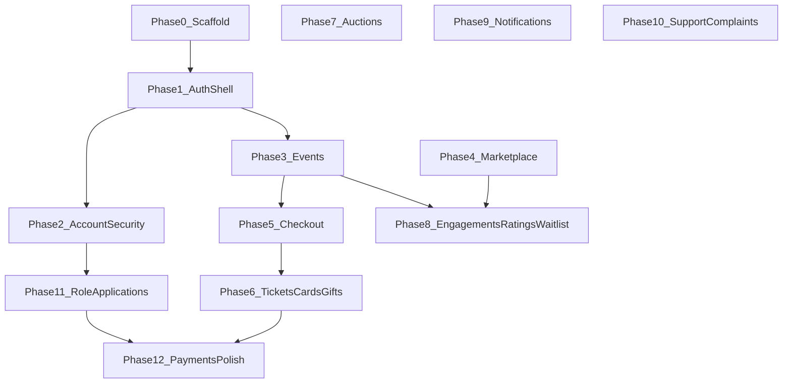

# MyTicket main website — backend integration phases

This document breaks migration from mock/client-only behavior into **ordered phases** so work can be tracked in tickets or PRs without redoing scope each time. Canonical endpoint detail stays in [`API_REFERENCE.md`](API_REFERENCE.md) (from [`collection.json`](collection.json), `/api/v1/main/*` only). Admin (`/api/v1/admin/*`) is out of scope for this site.

## How to use

- Treat each phase as **one or more PRs** (prefer smaller PRs per subdomain).
- For each phase: wire RTK Query hooks already scaffolded under [`src/api/endpoints/`](src/api/endpoints/), replace mock services/context reads where listed, add RHF + Yup where forms exist in [`src/schemas/`](src/schemas/).
- After each phase: `npm run build`, lint files touched, smoke test flows listed.
- See **§ Coverage gaps** at the end for features with no backend equivalent yet.

---

## Phase 0 — Scaffold (done)

**Goal:** Shared HTTP layer, types, Yup schemas, Redux store, env wiring.

**Deliverables**

- [`src/api/baseApi.ts`](src/api/baseApi.ts), [`src/store/`](src/store/), [`src/api/endpoints/*`](src/api/endpoints/), [`src/schemas/*`](src/schemas/), [`API_REFERENCE.md`](API_REFERENCE.md).

**Verification**

- App builds; no requirement to call production APIs yet.

---

## Phase 1 — Auth shell (done)

**Goal:** Login, register (basic account only), forgot/reset password, OAuth callback, token persistence, `/me` hydration onto existing `MockUser` shape; **keep** role onboarding and profile security mock-only for now.

**API_REFERENCE sections:** §2 Auth (public), relevant parts of §10 Profile (`GET/PATCH /me` for hydration).

**Key UI**

- [`src/pages/auth/LoginPage.tsx`](src/pages/auth/LoginPage.tsx), [`RegisterPage.tsx`](src/pages/auth/RegisterPage.tsx), [`ForgotPasswordPage.tsx`](src/pages/auth/ForgotPasswordPage.tsx), [`ResetPasswordPage.tsx`](src/pages/auth/ResetPasswordPage.tsx), [`OAuthCallbackPage.tsx`](src/pages/auth/OAuthCallbackPage.tsx).

**Key integration**

- [`src/contexts/AuthContext.tsx`](src/contexts/AuthContext.tsx) — facade for consumers; onboarding actions still write [`myticket_mock_auth`](src/contexts/AuthContext.tsx).

**Verification**

- Register → login → logout; tokens cleared; hard refresh restores session via `/me`; OAuth round-trip; optional 2FA challenge path if backend sends challenge envelope.

---

## Phase 2 — Account, sessions, security (authenticated auth)

**Goal:** Replace mock-only profile security and account mutations with real APIs; align `/me` updates with backend.

**API_REFERENCE sections:** §3 Auth (authenticated, incl. `password/change` + `email/change`), §10 Profile (`/me`, `/me/preferences`, `/me/sessions`, `/me/devices`, `/me/talent-availability`, `DELETE /me`).

**Likely UI**

- [`src/pages/profile/ProfilePage.tsx`](src/pages/profile/ProfilePage.tsx) and profile tabs (account, security, preferences, danger).

**Notes**

- Email/phone verify, 2FA setup/confirm/disable, refresh token usage, session revoke — wire to hooks from [`src/api/endpoints/auth.ts`](src/api/endpoints/auth.ts) and [`src/api/endpoints/me.ts`](src/api/endpoints/me.ts).
- Change-password now uses real `POST /auth/password/change` (resolved gap **#2**); `changePasswordMock` can be deleted in this phase.
- Preferences (language / theme / marketing + email/push/sms) consolidate behind `GET/PATCH /me/preferences` (resolved gap **#4**) — drop the `MockUser.preferences` writes.
- `DELETE /me` (resolved gap **#6**) replaces the `queueTicketsForAccountDeletionMock()` + `signOut()` flow in the Danger tab; use the `confirmation: "DELETE"` literal gate.

**Verification**

- Update display name / bio / avatar via `PATCH /me`; list / revoke sessions; list / remove devices via the new `GET /me/devices`; toggle language / theme via `/me/preferences`; full delete-account smoke including the resale-queue counter in the response.

---

## Phase 3 — Events discovery

**Goal:** Events listing, featured, detail, categories, lineup, gallery, occurrences, ticket types — replace [`src/services/eventsService.ts`](src/services/eventsService.ts) usage.

**API_REFERENCE sections:** §7 Events (incl. `GET /events/categories`, `GET /events/cities`), §23 Reference data.

**Likely UI**

- [`src/pages/events/EventsPage.tsx`](src/pages/events/EventsPage.tsx), [`EventDetailPage.tsx`](src/pages/events/EventDetailPage.tsx), home sections that list events.

**Notes**

- Filter chips and the city dropdown now hydrate from `useGetEventCategoriesQuery` / `useGetEventCitiesQuery` (resolved gap **#12**) — drop the inline category constants.

**Verification**

- Pagination/filter behavior matches `Paginated<T>` handling in [`src/api/types/common.ts`](src/api/types/common.ts).

---

## Phase 4 — Marketplace directory

**Goal:** Talents, vendors, organizers listing and public profile/detail pages — replace [`src/services/marketplaceService.ts`](src/services/marketplaceService.ts).

**API_REFERENCE sections:** §4 Talents, §5 Vendors, §6 Organizers.

**Likely UI**

- [`src/pages/marketplace/MarketplacePage.tsx`](src/pages/marketplace/MarketplacePage.tsx), [`TalentProfilePage.tsx`](src/pages/marketplace/TalentProfilePage.tsx), [`VendorProfilePage.tsx`](src/pages/marketplace/VendorProfilePage.tsx), organizer surfaces if any.

**Verification**

- Slug-based navigation matches router; ratings subsection if wired in API.

---

## Phase 5 — Seats, orders, checkout

**Goal:** Seat maps / locks / hold flows and order creation — replace mock checkout path.

**API_REFERENCE sections:** §8 Seat locks (incl. `GET /events/{slug}/seats/lock`), §11 Orders & checkout.

**Likely UI**

- [`src/pages/checkout/SeatSelectionPage.tsx`](src/pages/checkout/SeatSelectionPage.tsx), [`CheckoutPage.tsx`](src/pages/checkout/CheckoutPage.tsx).

**Notes**

- On reload, hydrate the seat-picker timer from `useGetCurrentSeatLockQuery({ slug })` (resolved gap **#18**); the hook already collapses `204 No Content` to `null`.

**Verification**

- End-to-end: pick seats → create order → confirm payment step when integrated with provider; reload mid-hold and confirm the timer resumes from the existing lock.

---

## Phase 6 — Tickets, saved cards, gifts, favorites

**Goal:** Purchased tickets, transfers/refunds, gift inbox, favorites toggle, saved cards.

**API_REFERENCE sections:** §12 Tickets (incl. `check-overlap`, `{id}/cancel`), §13 Saved cards, §14 Gifts (incl. `GET /me/gifts`), §24 Favorites.

**Likely UI**

- [`src/pages/tickets/MyTicketsPage.tsx`](src/pages/tickets/MyTicketsPage.tsx), [`TicketDetailPage.tsx`](src/pages/tickets/TicketDetailPage.tsx), the Gifts inbox tab, the heart toggle on `EventCard` / event detail.

**Notes**

- Gap **#7** resolved: replace `myticket:favorite-event-ids` writes with `useToggleFavoriteMutation` and read favorites via `useListMyFavoritesQuery`.
- Gap **#10** resolved: hook the seat picker / cart up to `useCheckTicketOverlapMutation` and the cancel CTA to `useCancelTicketMutation`.
- Gap **#14** resolved: the gifts inbox view now calls `useListGiftsQuery`.
- Gap **#21** is exposed (`useValidateTicketMutation`) but the SPA's audience for it is being confirmed in the follow-up — keep it behind a feature flag for now.

**Verification**

- Align with [`src/services/ticketsService.ts`](src/services/ticketsService.ts) replacement plan; ensure favorites persistence survives a hard reload by reading from the API only.

---

## Phase 7 — Auctions

**Goal:** Public auction browse + authenticated bids / buy-now / cancel per API.

**API_REFERENCE sections:** §9 Auctions (public, incl. `GET /auctions/stats`), §15 Auctions (authenticated).

**Likely UI**

- [`src/pages/auction/AuctionPage.tsx`](src/pages/auction/AuctionPage.tsx), [`AuctionEventPage.tsx`](src/pages/auction/AuctionEventPage.tsx).

**Notes**

- Gap **#11** resolved: drop the client-side aggregate computation in `auctionService.ts → countListingsByEvent / nearestEndForEvent` and read `useGetAuctionStatsQuery` instead.

**Verification**

- Replace [`src/services/auctionService.ts`](src/services/auctionService.ts).

---

## Phase 8 — Engagements, ratings, waitlist

**Goal:** Organizer/talent engagement lifecycle; unified ratings; event waitlist.

**API_REFERENCE sections:** §16 Engagements (incl. `POST /me/engagements`), §17 Ratings (incl. `GET /me/ratings`), §18 Waitlist, §10 → talent availability.

**Likely UI**

- [`src/pages/marketplace/EngagementsPage.tsx`](src/pages/marketplace/EngagementsPage.tsx), event detail ratings, waitlist CTAs.

**Notes**

- Gap **#8** resolved: `useListMyRatingsQuery({ subject_type, subject_id })` lets the post-event "rate this" CTA detect duplicates without listing all ratings; drop the two `localStorage` rating stores.
- Gap **#9** resolved: the engagement-accept flow now calls `useSetTalentAvailabilityMutation({ status: 'reserved' })` instead of writing `myticket_talent_availability`.
- Gap **#19** resolved: the "contact this talent / vendor" CTA on profile pages calls `useCreateEngagementMutation` (no more `createOrganizerEngagementMock`).

**Verification**

- Replace [`src/services/engagementsService.ts`](src/services/engagementsService.ts), [`ratingsService.ts`](src/services/ratingsService.ts), [`waitlistService.ts`](src/services/waitlistService.ts).

---

## Phase 9 — Notifications

**Goal:** In-app notification list, read/mark actions, polling-driven badge.

**API_REFERENCE sections:** §19 Notifications (incl. `?since`, `unread_count`, `GET /me/notifications/stream`).

**Likely UI**

- [`src/contexts/NotificationContext.tsx`](src/contexts/NotificationContext.tsx) and components that consume it.

**Notes**

- Gap **#20** resolved as polling: read the cadence from `useGetNotificationsStreamQuery` (`poll_interval_seconds`, `since`), then drive `useListNotificationsQuery({ since })` on a timer. The `unread_count` field on the paginator envelope feeds the bell badge directly.

**Verification**

- Real-time delivery validated against the polling guidance (no SSE / WebSocket needed today). The `transport` discriminator lets us add streaming later without breaking the type.

---

## Phase 10 — Support & complaints

**Goal:** Support cases and complaint flows.

**API_REFERENCE sections:** §20 Support (incl. `GET /support/chat/{sessionId}`), §21 Complaints (incl. `GET /complaints/categories`).

**Likely UI**

- [`src/pages/support/SupportPage.tsx`](src/pages/support/SupportPage.tsx).

**Notes**

- Gap **#13** resolved: hydrate the chat widget on reload via `useGetSupportChatSessionQuery({ sessionId })` and drop the `myticket_support_chat_thread` localStorage cache.
- Gap **#15** resolved: drive the cascading category → subcategory select from `useGetComplaintCategoriesQuery`.

**Verification**

- Chat/support subpaths per collection; the chat hydrate / promote / resume flow runs end-to-end from a clean reload.

---

## Phase 11 — Role applications & onboarding alignment

**Goal:** Replace mock-only talent/vendor/organizer onboarding in [`AuthContext`](src/contexts/AuthContext.tsx) / register wizard with **`/role-applications/*`** and media/document sub-resources.

**API_REFERENCE sections:** §22 Role applications (incl. `GET /role-applications/{role}/{id}`).

**Likely UI**

- [`src/pages/auth/RegisterPage.tsx`](src/pages/auth/RegisterPage.tsx) onboarding stages, [`src/pages/profile/ProfilePage.tsx`](src/pages/profile/ProfilePage.tsx) role flows.

**Notes**

- Gap **#17** resolved: hydrate the wizard step from `useGetRoleApplicationQuery({ role, id })` (returns the merged core + sub-blob).
- Gap **#16** is **still open** and is the only hard blocker for this phase. Until backend confirms the full PATCH body, keep using:
  - `useUpdateTalentApplicationMutation` / `useUpdateVendorApplicationMutation` / `useUpdateOrganizerApplicationMutation` for the minimal fields;
  - `useAddTalentMediaMutation`, `useAddVendorDocumentMutation`, `useAddVendorGalleryItemMutation`, `useAddOrganizerSocialLinkMutation` for the array fields the wizard collects;
  - the field-level questions tracked in [`BACKEND_GAPS_FOLLOWUP.md`](BACKEND_GAPS_FOLLOWUP.md).

**Verification**

- Create → draft → submit → resubmit/withdraw per role; file uploads match backend expectations; reload mid-wizard rehydrates the step from the GET endpoint.

---

## Phase 12 — Payments & polish

**Goal:** Production payment confirmation (`/orders/{id}/confirm-payment` or as documented), remove dead mocks, tighten error handling, loading states, and [`API_REFERENCE.md`](API_REFERENCE.md) §23 gap resolutions where backend adds endpoints.

**Likely code**

- [`src/lib/paymentMock.ts`](src/lib/paymentMock.ts) taper-down; card validation remains aligned with [`src/schemas/payment.ts`](src/schemas/payment.ts).

---

## Coverage gaps (coordinate with backend or keep client-only)

After the 2026-05-07 backend update, the table below is mostly resolved. See [`BACKEND_GAPS.md`](BACKEND_GAPS.md) for the historical detail and [`BACKEND_GAPS_FOLLOWUP.md`](BACKEND_GAPS_FOLLOWUP.md) for the remaining open items.

| Topic | Direction |
| --- | --- |
| Favorites / hearted events | **Resolved** — `GET /me/favorites`, `PUT /me/favorites/{eventId}` (Phase 6 wires it). |
| Event-card quick ratings | **Resolved** — merge into `POST /ratings` + `GET /me/ratings` (Phase 8). |
| Talent availability flag | **Resolved** — `GET/PUT /me/talent-availability` (Phase 8). |
| Complaints sub-categories | **Resolved** — `GET /complaints/categories` (Phase 10). |
| Gifts inbox | **Resolved** — `GET /me/gifts` (Phase 6). |
| Device list view | **Resolved** — `GET /me/devices` (Phase 2). The exact `last_seen_at` shape is the only minor open item (see follow-up). |
| Saudi region/city seeds | **Resolved** — `GET /reference/saudi-regions` (Phase 11 hydrates from it). |
| Role-application full PATCH body fields | **Open** — gap **#16**; see [`BACKEND_GAPS_FOLLOWUP.md`](BACKEND_GAPS_FOLLOWUP.md). Phase 11 keeps using sub-resource POSTs in the meantime. |
| Gate ticket validation audience | **Open** — `POST /tickets/{ticketId}/validate` is exposed but whether the SPA may call it is being confirmed. |
| Admin API | Never call from this SPA. |

---

## Suggested dependency graph

Phases **9** and **10** can run in parallel with **7** or **8** once **1** is stable; **11** benefits from **2** (real `/me`) but can start after **1** if carefully scoped.

---

## Document maintenance

When `collection.json` changes materially, update [`API_REFERENCE.md`](API_REFERENCE.md) first, then adjust phase descriptions or ordering here if domains split/merge.
