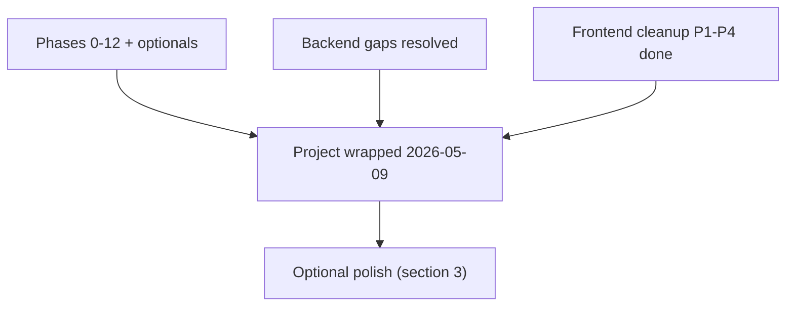

# MyTicket main website — project status

> **Status (2026-05-09):** project wrapped. Phases 0–12 of [IMPLEMENTATION_PHASES.md](IMPLEMENTATION_PHASES.md) are complete, including both Phase 12 optionals (saved-card picker on checkout, auction Place bid / Buy now). The last three open backend gaps were resolved on **2026-05-09** ([`BACKEND_TEAM_ANSWERS.md`](BACKEND_TEAM_ANSWERS.md) → [`BACKEND_GAPS_FOLLOWUP.md`](BACKEND_GAPS_FOLLOWUP.md)), and the four frontend cleanup PRs in [§2](#2-frontend-cleanup--completed-2026-05-09) all landed the same day.

This document is now a status snapshot. New readers should start from one of the **living references** below; this file only summarises how we got here and what optional polish remains.

| Living reference | Purpose |
|---|---|
| [`API_REFERENCE.md`](API_REFERENCE.md) | Live API contract (every endpoint the SPA calls). |
| [`myticket_main_website_flow.md`](myticket_main_website_flow.md) | Product flow + MySQL data-model spec. |
| [`IMPLEMENTATION_PHASES.md`](IMPLEMENTATION_PHASES.md) | Phase narrative / audit trail (0–12 + optionals). |
| [`BACKEND_GAPS_FOLLOWUP.md`](BACKEND_GAPS_FOLLOWUP.md) | Resolved backend-gaps ledger. |

---

## 1. Backend gaps — resolved (2026-05-09)

Summary of what backend confirmed and what we did:

| Item | Outcome |
|---|---|
| **#16 — Role-applications PATCH** | Talent + organizer `profile_image` and organizer `optional_document` are **PATCH JSON URL strings** (persisted server-side). Vendor: **no extra fields**. URLs as strings, not multipart on PATCH. Types updated in [`src/api/types/roleApplication.ts`](src/api/types/roleApplication.ts). **Caveat:** vendor `service_categories` may not persist on PATCH today — see JSDoc on `UpdateVendorApplicationRequest`. |
| **`GET /me/devices`** | **`last_seen_at`** is correct; extra push-token columns are infra-only. **`is_current` not shipped yet** — [`UserDevice.is_current`](src/api/types/user.ts) stays optional; Profile badge appears when backend adds the flag. |
| **Gate ticket validation** | **Scanner audience** (`/api/v1/scanner/*`) is canonical. Removed main SPA `validateTicket` hook + types; [`API_REFERENCE.md`](API_REFERENCE.md) points to scanner. |

Full traceability: [`BACKEND_GAPS_FOLLOWUP.md`](BACKEND_GAPS_FOLLOWUP.md) (resolved ledger) and [`BACKEND_TEAM_ANSWERS.md`](BACKEND_TEAM_ANSWERS.md).

---

## 2. Frontend cleanup — completed (2026-05-09)

The four PR-sized cleanup items previously tracked here all landed on the same day. Anchor files for each are listed below for traceability.

| Priority | Outcome | Anchor files |
|---|---|---|
| 1 | Route-level code-splitting via `React.lazy()` + `<Suspense>`. Main bundle dropped from ~2.1 MB (~600 kB gzip) to **388 kB (~116 kB gzip)** with heavy routes split into per-page chunks. | [`src/App.tsx`](src/App.tsx) |
| 2 | All eight deprecated mock-service files removed; only [`src/services/roleApplicationSubmit.ts`](src/services/roleApplicationSubmit.ts) remains under `src/services/`. Three call sites ([`CheckoutPage.tsx`](src/pages/checkout/CheckoutPage.tsx), [`SeatSelectionPage.tsx`](src/pages/checkout/SeatSelectionPage.tsx), [`EventDetailPage.tsx`](src/pages/events/EventDetailPage.tsx)) now use RTK Query / `EventDetail` directly. | [`src/services/`](src/services/), [`src/pages/events/EventDetailPage.tsx`](src/pages/events/EventDetailPage.tsx) |
| 3 | Mirrored `myticket_mock_auth` user cache deleted; [`AuthContext`](src/contexts/AuthContext.tsx) rehydrates from `GET /me` on cold start using the bearer token in [`authToken.ts`](src/api/authToken.ts). Route guards ([`RequireAuth`](src/components/auth/RequireAuth.tsx), [`RequireMarketplaceBrowse`](src/components/auth/RequireMarketplaceBrowse.tsx)) gate on `isHydrating` to prevent a cold-start bounce to `/login`. A one-shot `localStorage.removeItem('myticket_mock_auth')` migration shim cleans up legacy installs. | [`src/contexts/AuthContext.tsx`](src/contexts/AuthContext.tsx), [`src/components/auth/RequireAuth.tsx`](src/components/auth/RequireAuth.tsx), [`src/components/auth/RequireMarketplaceBrowse.tsx`](src/components/auth/RequireMarketplaceBrowse.tsx), [`src/api/authToken.ts`](src/api/authToken.ts) |
| 4 | Documentation aligned: [`MOCK_API_REFERENCE.md`](MOCK_API_REFERENCE.md) collapsed to a redirect, [`myticket_main_website_flow.md`](myticket_main_website_flow.md) swept of stale `src/services/*` and `paymentMock.ts` citations and the §18 persistence map rewritten, [`API_REFERENCE.md`](API_REFERENCE.md) §25 reframed as historical traceability. | [`MOCK_API_REFERENCE.md`](MOCK_API_REFERENCE.md), [`myticket_main_website_flow.md`](myticket_main_website_flow.md), [`API_REFERENCE.md`](API_REFERENCE.md) |

The Vite build warns that [`SeatSelectionPage`](src/pages/checkout/SeatSelectionPage.tsx) is still a large chunk (~1 MB / ~284 kB gzip). It is now its own lazy chunk, so the main bundle is unaffected; further internal splitting is optional.

---

## 3. Optional product polish (no remaining blockers)

Ship only if the product wants new surface area. None of these are required to "complete the project."

- **My auctions page** — cancel listing + bid history. Hooks scaffolded ([`useListMyAuctionsQuery`](src/api/endpoints/auctions.ts), [`useListMyAuctionBidsQuery`](src/api/endpoints/auctions.ts), [`useCancelAuctionMutation`](src/api/endpoints/auctions.ts)); no UI exists.
- **Direct add-saved-card on Profile** — currently parked behind the same tokenization-endpoint question that affects buy-now. Treat as another backend question if/when product asks for it.
- **Notifications transport upgrade** — [Phase 9](IMPLEMENTATION_PHASES.md#phase-9--notifications) ships polling-only; backend already typed `transport` discriminator so we can swap to SSE/WebSocket later without breaking clients.

---

## How to use this document

1. **For day-to-day work:** start from one of the [Living references](#myticket-main-website--project-status) at the top of this file. This document is no longer the entry point for active development.
2. **For history:** [`BACKEND_GAPS.md`](BACKEND_GAPS.md) is the original gap log and may be archived; [`BACKEND_GAPS_FOLLOWUP.md`](BACKEND_GAPS_FOLLOWUP.md) is the resolved ledger and should stay alongside [`BACKEND_TEAM_ANSWERS.md`](BACKEND_TEAM_ANSWERS.md) for audit.
3. **For future scope:** [§3](#3-optional-product-polish-no-remaining-blockers) only — and only when product asks.

