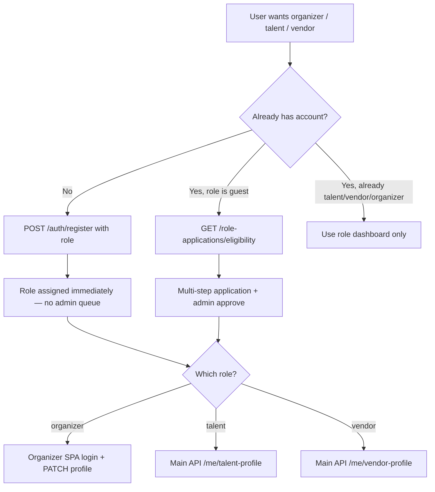

# Frontend handoff: Role onboarding (organizer, talent, vendor)

**Date:** 2026-06-28  
**API base (main):** `https://<host>/api/v1/main`  
**Auth:** Sanctum bearer — main routes need `app:main` (`app.scope:main_website`).

---

## Existing detailed docs (read these first)

| Doc | Use when |
|-----|----------|
| [`frontend-handoff-register-with-role.md`](frontend-handoff-register-with-role.md) | **Direct signup** — user picks organizer / talent / vendor at registration (no admin review) |
| [`frontend-handoff-role-upgrade.md`](frontend-handoff-role-upgrade.md) | **Guest upgrade** — existing guest applies → admin approves → role changes |
| [`frontend-handoff-talent-api.md`](frontend-handoff-talent-api.md) | Post-approval talent profile & dashboard |
| [`frontend-handoff-vendor-api.md`](frontend-handoff-vendor-api.md) | Post-approval vendor profile & dashboard |
| [`frontend-handoff-organizer-profile-api.md`](frontend-handoff-organizer-profile-api.md) | Post-approval organizer profile |
| [`API_REFERENCE.md`](API_REFERENCE.md) | Full endpoint list (§ Role applications) |

This file is the **entry point**. The two primary flows are fully specified in the docs above.

---

## Choose your path



| Path | Who | Admin review? | Primary doc |
|------|-----|---------------|-------------|
| **Direct register** | New user | **No** — role set on register | `frontend-handoff-register-with-role.md` |
| **Guest upgrade** | `users.role === "guest"` | **Yes** — submit application | `frontend-handoff-role-upgrade.md` |

**Do not mix:** register with `role: "organizer"` then call `POST /role-applications/organizer` → **403** (`role_upgrade_not_guest`).

**Not supported via these flows:** `admin`, `scanner` (staff-provisioned only).

---

## Path A — Direct register (recommended for dedicated signup pages)

### Request

```http
POST /api/v1/main/auth/register
Content-Type: application/json
```

```json
{
  "email": "org@example.com",
  "password": "Password123!",
  "full_name": "Org Name",
  "display_name": "Optional",
  "phone": "+9665...",
  "role": "organizer"
}
```

| `role` value | Default if omitted |
|--------------|-------------------|
| `guest` | ✓ (ticket buyer) |
| `organizer` | |
| `talent` | |
| `vendor` | |

### Response `201`

```json
{
  "message": "Registered successfully.",
  "user_id": 1,
  "role": "organizer",
  "token": "1|…",
  "refresh_token": null,
  "expires_at": "2026-06-23T12:00:00+00:00",
  "user": { "id": 1, "email": "…", "full_name": "…", "role": "organizer" }
}
```

Store `token` — it is **`app:main` only**.

### After register — by role

| Role | Next login | First profile setup |
|------|------------|---------------------|
| **Organizer** | `POST /api/v1/organizer/auth/login` (**required** — register token does not work on organizer API) | `PATCH /api/v1/organizer/me/profile` (first PATCH creates profile; `GET` returns 404 until then) |
| **Talent** | Optional `POST /api/v1/main/auth/login` | `PATCH /api/v1/main/me/talent-profile` |
| **Vendor** | Optional `POST /api/v1/main/auth/login` | `PATCH /api/v1/main/me/vendor-profile` |
| **Guest** | Use register `token` on main API | N/A |

Send `Accept-Language: ar|en` on all requests for localized `message` fields.

---

## Path B — Guest upgrade (apply → admin review)

### 1. Gate the UI

```http
GET /api/v1/main/role-applications/eligibility
Authorization: Bearer <main token>
```

Use `data.can_upgrade` to show/hide “Become an organizer / talent / vendor”.  
Use `data.next_steps.{role}.application_id` and `.status` to resume drafts.

### 2. Shared lifecycle

```
POST /role-applications/{talent|vendor|organizer}     → draft (201)
PATCH /role-applications/{role}/{id}                  → save fields
POST /uploads?context=…                             → files (optional)
… role-specific attachments (media, documents, categories, social links)
POST /role-applications/{role}/{id}/submit          → status: submitted
```

After admin **approve**: `users.role` changes; user must **re-login** (or refresh token) and open the correct app.

Track status: `GET /role-applications/me` or notifications (`role_application_approved` / rejected).

### 3. Create payloads (minimum)

**Talent** — `POST /role-applications/talent`

```json
{
  "stage_name": "DJ Ahmed",
  "contact_email": "talent@example.com",
  "contact_phone": "+9665..."
}
```

**Vendor** — `POST /role-applications/vendor`

```json
{
  "profile_name": "Catering Co",
  "contact_email": "vendor@example.com",
  "contact_phone": "+9665..."
}
```

**Organizer** — `POST /role-applications/organizer`

```json
{
  "display_name": "Events R Us",
  "contact_email": "org@example.com",
  "contact_phone": "+9665..."
}
```

### 4. Submit requirements (validation at submit)

| Role | Required before submit |
|------|------------------------|
| **Talent** | `stage_name`, `contact_email`, `bio` ≥ 30 chars, ≥ 1 media item, `accepted_quality_disclaimer: true` |
| **Vendor** | `profile_name`, `contact_email`, `bio` ≥ 25 chars, ≥ 1 document, ≥ 1 gallery image, ≥ 1 service category |
| **Organizer** | `display_name`, `contact_email` |

Full field maps, PATCH shapes, and attachment endpoints → **`frontend-handoff-role-upgrade.md`** §§8–10.

### 5. After admin approval

| New role | Login | Profile |
|----------|-------|---------|
| Talent | `POST /api/v1/main/auth/login` | `GET /api/v1/main/me/talent-profile` |
| Vendor | `POST /api/v1/main/auth/login` | `GET /api/v1/main/me/vendor-profile` |
| Organizer | `POST /api/v1/organizer/auth/login` | `GET /api/v1/organizer/me/profile` |

---

## Endpoint quick reference (main website)

All under `/api/v1/main`, bearer required unless noted.

| Purpose | Method | Path |
|---------|--------|------|
| Register with role | POST | `/auth/register` |
| Upgrade eligibility | GET | `/role-applications/eligibility` |
| My applications | GET | `/role-applications/me` |
| Application detail | GET | `/role-applications/{talent\|vendor\|organizer}/{id}` |
| Create draft | POST | `/role-applications/talent` \| `/vendor` \| `/organizer` |
| Update draft | PATCH | `/role-applications/{role}/{id}` |
| Submit | POST | `/role-applications/{role}/{id}/submit` |
| Resubmit (after reject) | POST | `/role-applications/{role}/{id}/resubmit` |
| Withdraw | POST | `/role-applications/{role}/{id}/withdraw` |
| File upload | POST | `/uploads?context=talent_application\|vendor_application\|vendor_document` |

Role-specific attachments (talent media/categories, vendor docs/gallery/categories, organizer social links) — see matrix in **`frontend-handoff-role-upgrade.md`** §4.

---

## What the frontend must implement

### All flows

- [ ] Send `Accept-Language` (`ar` / `en`) on API calls
- [ ] Branch UI on `GET /me` → `user.role` (`guest` vs marketplace roles)
- [ ] When `GET /me` includes `role_upgrade_request`, show pending/rejected status on Profile → Roles instead of upgrade banners (see `role_upgrade_request` in **API_REFERENCE** §10)
- [ ] Handle 403 `role_upgrade_not_guest` on application mutations

### Direct register flow

- [ ] Signup form sends `role` on `POST /auth/register` when not guest
- [ ] Persist `token` from `201`; skip redundant login on main when using register token
- [ ] **Organizer:** separate `POST /organizer/auth/login` before organizer routes
- [ ] First profile `PATCH` after email verify (organizer profile 404 until first save)
- [ ] **Do not** open role-application wizard after direct register

### Guest upgrade flow

- [ ] `GET /role-applications/eligibility` on “Upgrade account” entry
- [ ] Wizard per role: create → patch → uploads → attachments → submit
- [ ] Read-only UI while `status === "submitted"`
- [ ] Rejected: show `rejection_reason`, allow edit + `resubmit`
- [ ] Poll `GET /role-applications/me` or listen for approval notification
- [ ] After approve: force re-login and redirect to correct SPA

### Post-onboarding (live profiles)

- [ ] Talent: `frontend-handoff-talent-api.md`
- [ ] Vendor: `frontend-handoff-vendor-api.md`
- [ ] Organizer: `frontend-handoff-organizer-profile-api.md` + organizer event editor handoff

---

## Error codes (guest upgrade)

| HTTP | `code` | Meaning |
|------|--------|---------|
| 403 | `role_upgrade_not_guest` | Only guests can create/edit applications |
| 422 | — | Submit validation failed (incomplete form) |
| 422 | — | Invalid status transition (e.g. patch while submitted) |

---

## Product note

| Flow | Admin review |
|------|----------------|
| Register with `role: organizer\|talent\|vendor` | **No** — immediate role |
| Guest `role-applications` → approve | **Yes** — admin queue at `/api/v1/admin/role-applications` |

Pick one product path per signup UX; document which you ship in the main app vs separate organizer/talent/vendor SPAs.

---

## Related platform update handoffs

- [`frontend-handoff-main-platform-updates.md`](frontend-handoff-main-platform-updates.md)
- [`frontend-handoff-organizer-platform-updates.md`](frontend-handoff-organizer-platform-updates.md)
- [`frontend-handoff-talent-platform-updates.md`](frontend-handoff-talent-platform-updates.md)
- [`frontend-handoff-vendor-platform-updates.md`](frontend-handoff-vendor-platform-updates.md)
