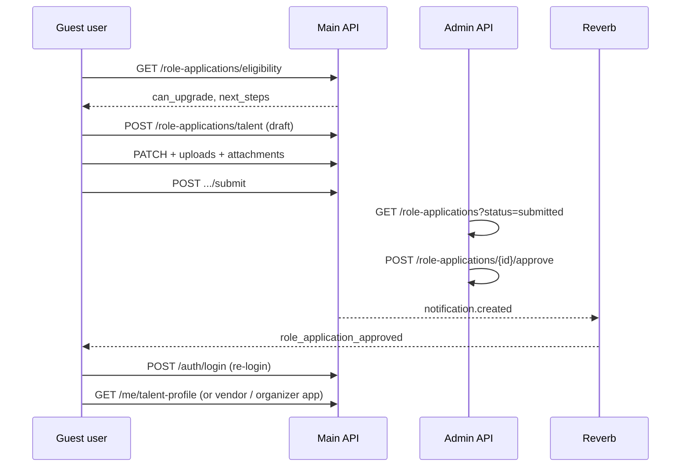

# Frontend handoff: Guest role upgrade

**Audience:** Main website React SPA, Admin dashboard (review queue)  
**API base (main):** `https://myticket-api.kat-jr.com/api/v1/main`  
**API base (admin):** `https://myticket-api.kat-jr.com/api/v1/admin`  
**Auth:** Sanctum bearer token — main routes require ability `app:main` (`app.scope:main_website`); admin routes require `app:admin`.

This document describes how a **guest** (normal main-site user — the role that buys tickets and reserves seats) can **upgrade** to **Talent**, **Vendor**, or **Organizer**. There is **no downgrade** through this flow.

---

## 1. Feature overview

| Rule | Behavior |
|------|----------|
| Who can upgrade | Only users with `users.role === "guest"` |
| Target roles | `talent`, `vendor`, `organizer` only |
| Not allowed | `admin`, `scanner`, or users who already upgraded (`talent` / `vendor` / `organizer`) |
| Flow | Multi-step application form → submit → admin review → approve/reject |
| On approve | `users.role` changes to the application type; marketplace profile is provisioned |
| On reject | User stays `guest`; may edit and **resubmit** |
| Downgrade | Not supported |

**UX entrypoint:** call `GET /role-applications/eligibility` when the user opens “Upgrade account” / “Become a talent/vendor/organizer”.

---

## 2. Recommended UX flow



1. **Check eligibility** — hide upgrade CTAs when `can_upgrade === false`.
2. **Pick target role** — one application per type (talent, vendor, organizer); DB allows at most one row per `(user_id, application_type)`.
3. **Draft form** — create draft, patch fields, upload files, add media/documents/categories.
4. **Submit** — moves status to `submitted`; user waits for admin.
5. **Track status** — poll `GET /role-applications/me` or listen for `.notification.created` on `private-user.{userId}`.
6. **After approval** — prompt **re-login** (or `POST /auth/refresh`) so the token picks up the new role; redirect to the correct dashboard.

---

## 3. Status machine

```
draft ──submit──► submitted ──approve──► approved (terminal)
  │                  │
  │                  └──reject──► rejected ──resubmit──► submitted
  │
  └──withdraw──► rejected (rejection_reason: "Withdrawn by applicant")
```

| Status | Guest can edit? | Notes |
|--------|-----------------|-------|
| `draft` | Yes | Default after create |
| `submitted` | No | Awaiting admin |
| `rejected` | Yes | Resubmit or withdraw |
| `approved` | No | Role already upgraded |

---

## 4. Endpoint matrix

### 4.1 Main website (applicant)

All paths are under `/api/v1/main`. Headers: `Authorization: Bearer <token>`, `Accept: application/json`.

| Method | Path | Purpose | Guest-only mutate? |
|--------|------|---------|-------------------|
| GET | `/role-applications/eligibility` | Discovery / CTA gating | — |
| GET | `/role-applications/me` | List my applications | Read: any main user |
| GET | `/role-applications/{role}/{id}` | Detail (`role` = talent \| vendor \| organizer) | Read: any main user |
| POST | `/role-applications/talent` | Create talent draft | Yes |
| PATCH | `/role-applications/talent/{id}` | Update talent draft/rejected | Yes |
| POST | `/role-applications/talent/{id}/submit` | Submit for review | Yes |
| POST | `/role-applications/talent/{id}/resubmit` | Resubmit after reject | Yes |
| POST | `/role-applications/talent/{id}/withdraw` | Withdraw | Yes |
| POST | `/role-applications/talent/{id}/media` | Add media | Yes |
| DELETE | `/role-applications/talent/{id}/media/{mediaId}` | Remove media | Yes |
| POST | `/role-applications/talent/{id}/categories` | Add category | Yes |
| PUT | `/role-applications/talent/{id}/categories` | Sync categories | Yes |
| DELETE | `/role-applications/talent/{id}/categories/{rowId}` | Remove category | Yes |
| POST | `/role-applications/vendor` | Create vendor draft | Yes |
| PATCH | `/role-applications/vendor/{id}` | Update vendor draft/rejected | Yes |
| POST | `/role-applications/vendor/{id}/submit` | Submit | Yes |
| POST | `/role-applications/vendor/{id}/resubmit` | Resubmit | Yes |
| POST | `/role-applications/vendor/{id}/withdraw` | Withdraw | Yes |
| POST | `/role-applications/vendor/{id}/documents` | Add document | Yes |
| DELETE | `/role-applications/vendor/{id}/documents/{docId}` | Remove document | Yes |
| POST | `/role-applications/vendor/{id}/gallery` | Add gallery image | Yes |
| DELETE | `/role-applications/vendor/{id}/gallery/{itemId}` | Remove gallery item | Yes |
| POST | `/role-applications/vendor/{id}/categories` | Add service category | Yes |
| PUT | `/role-applications/vendor/{id}/categories` | Sync categories | Yes |
| DELETE | `/role-applications/vendor/{id}/categories/{rowId}` | Remove category | Yes |
| POST | `/role-applications/organizer` | Create organizer draft | Yes |
| PATCH | `/role-applications/organizer/{id}` | Update organizer draft/rejected | Yes |
| POST | `/role-applications/organizer/{id}/submit` | Submit | Yes |
| POST | `/role-applications/organizer/{id}/resubmit` | Resubmit | Yes |
| POST | `/role-applications/organizer/{id}/withdraw` | Withdraw | Yes |
| POST | `/role-applications/organizer/{id}/social-links` | Add social link | Yes |
| DELETE | `/role-applications/organizer/{id}/social-links/{linkId}` | Remove social link | Yes |
| POST | `/uploads` | Upload file before PATCH (see §7) | Main auth |

### 4.2 Admin (reviewer)

| Method | Path | Purpose |
|--------|------|---------|
| GET | `/role-applications?status=&type=` | Paginated queue (`type` = talent \| vendor \| organizer) |
| GET | `/role-applications/{id}` | Full detail with typed payload |
| POST | `/role-applications/{id}/approve` | Approve → provisions profile + sets user role |
| POST | `/role-applications/{id}/reject` | Reject — **requires** `rejection_reason` |
| POST | `/role-applications/{id}/request-changes` | Alias of reject |

---

## 5. Eligibility endpoint (new)

### `GET /role-applications/eligibility`

**Success `200` — eligible guest**

```json
{
  "data": {
    "can_upgrade": true,
    "current_role": "guest",
    "allowed_target_roles": ["talent", "vendor", "organizer"],
    "reason_code": null,
    "reason_message": null,
    "applications": [
      {
        "id": 3,
        "application_type": "talent",
        "status": "draft",
        "submitted_at": null,
        "reviewed_at": null,
        "rejection_reason": null
      }
    ],
    "next_steps": {
      "talent": {
        "create": "POST /api/v1/main/role-applications/talent",
        "status": "draft",
        "application_id": 3
      },
      "vendor": {
        "create": "POST /api/v1/main/role-applications/vendor",
        "status": null,
        "application_id": null
      },
      "organizer": {
        "create": "POST /api/v1/main/role-applications/organizer",
        "status": null,
        "application_id": null
      }
    }
  }
}
```

**Success `200` — not eligible (e.g. already talent)**

```json
{
  "data": {
    "can_upgrade": false,
    "current_role": "talent",
    "allowed_target_roles": [],
    "reason_code": "role_upgrade_not_guest",
    "reason_message": "Only guest accounts can upgrade their role.",
    "applications": [],
    "next_steps": {}
  }
}
```

**Frontend:** use `can_upgrade` to show/hide upgrade UI. Use `next_steps[role].application_id` and `status` to deep-link into an in-progress form.

---

## 6. Error codes

| HTTP | `code` | When |
|------|--------|------|
| 403 | `role_upgrade_not_guest` | Guest-only mutation attempted by non-guest |
| 422 | `role_upgrade_not_guest` | Admin approve when applicant is no longer `guest` |
| 422 | — | Validation (incomplete payload on submit) |
| 422 | — | Invalid status transition |
| 404 | — | Application not found or not owned |

**403 body (mutations):**

```json
{
  "message": "Only guest accounts can upgrade their role.",
  "code": "role_upgrade_not_guest"
}
```

---

## 7. File uploads

Use **`POST /api/v1/main/uploads`** with multipart field `file` and query/body `context`:

| Context | Use for |
|---------|---------|
| `talent_application` | Talent profile image, showreel stills |
| `vendor_application` | Vendor gallery during application |
| `vendor_document` | CR / verification PDFs |

**Example**

```http
POST /api/v1/main/uploads?context=talent_application
Content-Type: multipart/form-data
Authorization: Bearer <token>

file=<binary>
```

**Response `201`**

```json
{
  "data": {
    "url": "https://myticket-api.kat-jr.com/storage/marketplace/talent-media/abc.jpg",
    "content_type": "image/jpeg",
    "size_bytes": 12034
  }
}
```

Pass `data.url` into:

- Talent: `PATCH .../talent/{id}` field `profile_image`, or `POST .../media` field `value`
- Vendor: `POST .../documents` / `POST .../gallery`
- Organizer: `PATCH .../organizer/{id}` field `profile_image` or `optional_document`

---

## 8. Talent application

### Create — `POST /role-applications/talent`

| Field | Type | Required | Rules |
|-------|------|----------|-------|
| `stage_name` | string | Yes | max 160 |
| `contact_email` | string | Yes | email |
| `contact_phone` | string | No | max 20 |

**Success `201`**

```json
{
  "data": {
    "id": 3,
    "user_id": 19,
    "application_type": "talent",
    "status": "draft",
    "submitted_at": null,
    "reviewed_at": null,
    "reviewed_by": null,
    "rejection_reason": null,
    "internal_note": null,
    "created_at": "2026-06-15T10:00:00.000000Z",
    "updated_at": "2026-06-15T10:00:00.000000Z"
  }
}
```

### Patch — `PATCH /role-applications/talent/{id}`

| Field | Maps to | Notes |
|-------|---------|-------|
| `stage_name` | `talent_applications.stage_name` | |
| `contact_email` | `contact_email` | |
| `contact_phone` | `contact_phone` | |
| `profile_image` | `profile_image_url` | URL string |
| `bio` | `bio` | min **30** chars required at submit |
| `saudi_region_id` | `region_id` | integer |
| `city` | `city_id` | integer |
| `travel_ready` | `travel_ready` | boolean |
| `location_public` | `location_public` | boolean |
| `certificate_name` | `certificate_name` | |
| `accepted_quality_disclaimer` | `accepted_quality_disclaimer` | must be `true` at submit |
| `internal_note` | `role_applications.internal_note` | applicant-only |

### Media — `POST /role-applications/talent/{id}/media`

| Field | Type | Required | Rules |
|-------|------|----------|-------|
| `kind` | string | Yes | `url` \| `video` \| `image` \| `certificate` |
| `value` | string | Yes | URL, max 500 |
| `label` | string | No | max 255 |
| `position` | integer | No | min 0 |

At least **one** media row required before submit.

### Categories

- `POST /role-applications/talent/{id}/categories` — body: `{ "talent_category_id": 1 }` or `{ "slug": "dj" }`
- `PUT /role-applications/talent/{id}/categories` — body: `{ "talent_category_ids": [1, 2] }` or `{ "slugs": ["dj", "mc"] }`

### Submit validation summary

- `stage_name`, `contact_email` filled
- `bio` ≥ 30 characters
- ≥ 1 media item
- `accepted_quality_disclaimer === true`

---

## 9. Vendor application

### Create — `POST /role-applications/vendor`

| Field | Type | Required | Rules |
|-------|------|----------|-------|
| `profile_name` | string | Yes | max 160 — business/display name |
| `contact_email` | string | Yes | email |
| `contact_phone` | string | No | max 20 |

### Patch — `PATCH /role-applications/vendor/{id}`

| Field | Maps to | Notes |
|-------|---------|-------|
| `business_name` | `profile_name` | |
| `contact_email` | `contact_email` | |
| `contact_phone` | `contact_phone` | |
| `bio` | `bio` | min **25** chars at submit |
| `city` | `city_id` | |
| `coverage_area` | `coverage_area` | |

### Documents — `POST /role-applications/vendor/{id}/documents`

| Field | Type | Required |
|-------|------|----------|
| `kind` | string | Yes — `url` \| `document` |
| `value` | string | Yes — URL max 500 |
| `label` | string | No |
| `position` | integer | No |

### Gallery — `POST /role-applications/vendor/{id}/gallery`

| Field | Type | Required |
|-------|------|----------|
| `image_url` | string | Yes — max 500 |
| `caption` | string | No |
| `position` | integer | No |

### Categories

- `POST /role-applications/vendor/{id}/categories` — `{ "service_category_id": 1 }` or `{ "slug": "catering" }`
- `PUT /role-applications/vendor/{id}/categories` — `{ "service_category_ids": [1,2] }` or `{ "slugs": ["catering"] }`

### Submit validation summary

- `profile_name`, `contact_email` filled
- `bio` ≥ 25 characters
- ≥ 1 document, ≥ 1 gallery image, ≥ 1 service category

---

## 10. Organizer application

### Create — `POST /role-applications/organizer`

| Field | Type | Required | Rules |
|-------|------|----------|-------|
| `display_name` | string | Yes | max 160 |
| `contact_email` | string | Yes | email |
| `contact_phone` | string | No | max 20 |

### Patch — `PATCH /role-applications/organizer/{id}`

| Field | Notes |
|-------|-------|
| `display_name` | |
| `contact_email`, `contact_phone` | |
| `profile_image` | maps to `profile_image_url` |
| `bio` | |
| `company_name`, `company_info` | |
| `owner_name`, `owner_info` | |
| `optional_document` | maps to `document_url` |

### Social links — `POST /role-applications/organizer/{id}/social-links`

| Field | Type | Required |
|-------|------|----------|
| `platform` | string | Yes — `website`, `instagram`, `twitter`, `tiktok`, `facebook`, `youtube`, `snapchat`, `other` |
| `url` | string | Yes — valid URL |
| `position` | integer | No |

### Submit validation summary

- `display_name`, `contact_email` filled

---

## 11. Shared lifecycle responses

### `POST .../{id}/submit` — Success `200`

```json
{
  "data": {
    "id": 3,
    "application_type": "talent",
    "status": "submitted",
    "submitted_at": "2026-06-15T12:00:00.000000Z",
    "rejection_reason": null
  }
}
```

### `POST .../{id}/resubmit`

Only from `rejected`. Same response shape as submit.

### `POST .../{id}/withdraw`

Sets `status` to `rejected` with `rejection_reason: "Withdrawn by applicant"`.

### `GET /role-applications/me` — Success `200`

```json
{
  "data": [
    {
      "id": 3,
      "user_id": 19,
      "application_type": "talent",
      "status": "submitted",
      "talent_application": { "stage_name": "DJ Ahmed", "contact_email": "..." },
      "vendor_application": null,
      "organizer_application": null
    }
  ]
}
```

---

## 12. Admin review

### List — `GET /role-applications?status=submitted&type=talent`

Paginated (`per_page: 20`). Each row includes `applicant` relation.

### Approve — `POST /role-applications/{id}/approve`

**Success `200`**

```json
{
  "data": {
    "id": 3,
    "status": "approved",
    "reviewed_at": "2026-06-15T14:00:00.000000Z",
    "reviewed_by": 1
  }
}
```

Side effects:

1. `users.role` → `talent` \| `vendor` \| `organizer`
2. Profile row created (`talent_profiles`, `vendor_profiles`, or `organizer_profiles`)
3. In-app notification `kind: role_application_approved` to applicant

### Reject — `POST /role-applications/{id}/reject`

**Body**

```json
{
  "rejection_reason": "Bio is too short; please add performance history."
}
```

`rejection_reason` is **required** (422 if missing).

---

## 13. After approval — login and dashboards

| New role | `users.role` | Login endpoint | Where to go next |
|----------|--------------|----------------|------------------|
| Talent | `talent` | `POST /api/v1/main/auth/login` | Talent SPA + `GET /me/talent-profile` |
| Vendor | `vendor` | `POST /api/v1/main/auth/login` | Vendor SPA + `GET /me/vendor-profile` |
| Organizer | `organizer` | `POST /api/v1/organizer/auth/login` | Organizer dashboard + `GET /me/profile` |

### Re-login notice (important)

Existing Sanctum tokens keep the **old** role abilities until refresh. After approval:

1. Show success modal from notification or polling.
2. Call `POST /api/v1/main/auth/logout` (optional).
3. Re-login (or `POST /api/v1/main/auth/refresh` for main-scoped token).
4. Redirect to the role-specific app.

### Realtime

Subscribe to `private-user.{userId}` and listen for `.notification.created`. Reconcile with `GET /me/notifications?since=`. See [`socket-and-chat/frontend-realtime-integration-guide.md`](socket-and-chat/frontend-realtime-integration-guide.md).

---

## 14. Frontend QA checklist

- [ ] Guest sees upgrade CTAs; talent/vendor/organizer/admin/scanner do not
- [ ] `GET /eligibility` matches UI state for in-progress drafts
- [ ] Non-guest receives 403 + `role_upgrade_not_guest` on create
- [ ] Talent submit blocked until bio, media, disclaimer satisfied
- [ ] Vendor submit blocked until documents, gallery, categories satisfied
- [ ] Submitted applications are read-only on main
- [ ] Rejected flow: show `rejection_reason`, allow edit + resubmit
- [ ] Admin reject requires reason text
- [ ] After approve: notification received, re-login works, correct dashboard loads
- [ ] Organizer approve: `POST /organizer/auth/login` succeeds

---

## 15. Related docs

- Talent profile (post-approval): [`frontend-handoff-talent-api.md`](frontend-handoff-talent-api.md)
- Vendor profile (post-approval): [`frontend-handoff-vendor-api.md`](frontend-handoff-vendor-api.md)
- Realtime notifications: [`socket-and-chat/frontend-realtime-integration-guide.md`](socket-and-chat/frontend-realtime-integration-guide.md)
- Sprint reference: [`sprints/PHASE-04-role-applications.md`](sprints/PHASE-04-role-applications.md)
