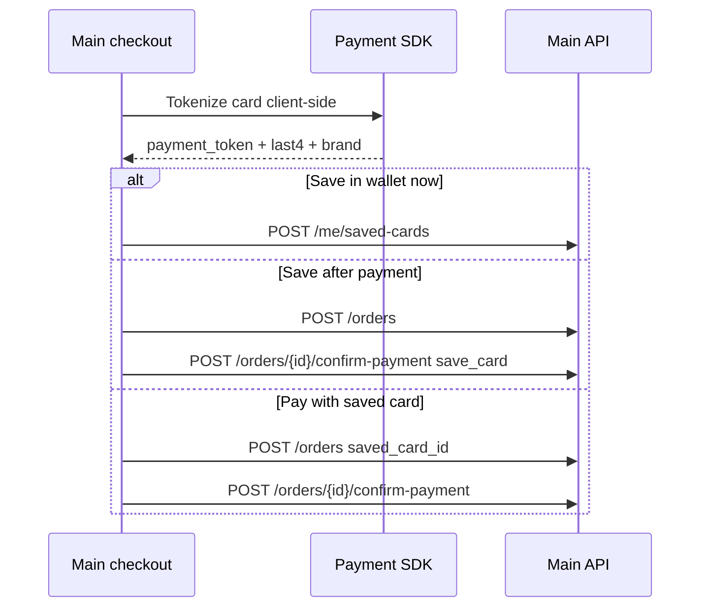

# Frontend handoff: Saved payment cards (main website)

**Audience:** Main website checkout / account settings  
**API base:** `https://myticket-api.kat-jr.com/api/v1/main`  
**Auth:** Sanctum bearer token (`app:main`, `app.scope:main_website`)

Users can save tokenized cards for faster checkout. The API **never** accepts raw card numbers (PAN) or CVV — only **payment gateway tokens** produced client-side by your PSP SDK (Moyasar, HyperPay, Tap, etc.). Local dev uses gateway `local` with tokens prefixed `tok_`.

---

## 1. Security rules (required)

| Rule | Detail |
|------|--------|
| No PAN/CVV | Do **not** send `card_number`, `pan`, `cvv`, or `cvc` to this API |
| Token only | Send `payment_token` (alias `token`) from the gateway after client-side tokenization |
| Safe responses | `gateway_token` is **never** returned in JSON; stored **encrypted** at rest |
| Ownership | Users can only list/update/delete their own cards |
| Limit | Max **10** active cards per user (configurable server-side) |

---

## 2. Endpoints

| Method | Path | Purpose |
|--------|------|---------|
| GET | `/me/saved-cards` | List saved cards (safe fields only) |
| POST | `/me/saved-cards` | Save a new card from gateway token |
| PATCH | `/me/saved-cards/{id}` | Set card as default |
| DELETE | `/me/saved-cards/{id}` | Remove saved card (soft delete) |

### Checkout integration (existing)

| Method | Path | Saved card usage |
|--------|------|------------------|
| POST | `/orders` | Optional `saved_card_id` — must belong to the logged-in user |
| POST | `/orders/{id}/confirm-payment` | Optional `save_card: true` + token metadata to store card after successful payment |

---

## 3. `GET /me/saved-cards`

**Success `200`**

```json
{
  "data": [
    {
      "id": 12,
      "brand": "visa",
      "last4": "4242",
      "cardholder_name": "Ahmed Ali",
      "expiry_month": 12,
      "expiry_year": 2028,
      "is_default": true,
      "created_at": "2026-06-15T10:00:00.000000Z",
      "updated_at": "2026-06-15T10:00:00.000000Z"
    }
  ]
}
```

Cards are ordered with default first, then newest.

---

## 4. `POST /me/saved-cards`

Save a card from a gateway token (wallet / account settings flow).

### Request body

| Field | Type | Required | Rules |
|-------|------|----------|-------|
| `payment_token` | string | Yes* | 8–255 chars; from PSP SDK (`token` alias accepted) |
| `brand` | string | Yes | `visa` \| `mastercard` \| `mada` \| `amex` \| `other` |
| `last4` | string | Yes | exactly 4 digits |
| `cardholder_name` | string | No | max 120 |
| `expiry_month` | integer | No | 1–12 |
| `expiry_year` | integer | No | not in the past |
| `is_default` | boolean | No | first card becomes default automatically |

**Success `201`**

```json
{
  "data": {
    "id": 12,
    "brand": "visa",
    "last4": "4242",
    "cardholder_name": "Ahmed Ali",
    "expiry_month": 12,
    "expiry_year": 2028,
    "is_default": true,
    "created_at": "2026-06-15T10:00:00.000000Z",
    "updated_at": "2026-06-15T10:00:00.000000Z"
  }
}
```

**Errors**

| HTTP | When |
|------|------|
| 422 | Missing/invalid token, raw card fields sent, max cards reached |
| 401 | Not authenticated |

**422 example (raw card rejected)**

```json
{
  "message": "The card number field is prohibited.",
  "errors": {
    "card_number": ["Raw card data must not be sent to the API. Use payment_token from your gateway SDK."]
  }
}
```

---

## 5. `PATCH /me/saved-cards/{id}`

Set a card as the default for checkout.

### Request body

```json
{
  "is_default": true
}
```

Only `is_default: true` is supported.

**Success `200`** — same card shape as POST response.

**404** — card not found or not owned by user.

---

## 6. `DELETE /me/saved-cards/{id}`

**Success `200`**

```json
{
  "message": "Deleted"
}
```

If the deleted card was default, the newest remaining card is promoted to default.

---

## 7. Checkout: use saved card on order

### `POST /orders`

Add optional `saved_card_id`:

```json
{
  "event_id": 42,
  "lock_id": 100,
  "ticket_type_quantities": { "3": 2 },
  "payment_method": "visa",
  "saved_card_id": 12
}
```

Server validates the card belongs to the current user.

### `POST /orders/{id}/confirm-payment`

Pay and optionally save the card used in this session:

```json
{
  "save_card": true,
  "payment_token": "tok_from_gateway",
  "brand": "visa",
  "last4": "4242",
  "cardholder_name": "Ahmed Ali",
  "expiry_month": 12,
  "expiry_year": 2028
}
```

When `save_card` is `true`, `brand` and `last4` are required. On success the order’s `saved_card_id` is updated.

---

## 8. Frontend flow



---

## 9. Local development

- Set `PAYMENT_GATEWAY=local` (default).
- Any token starting with `tok_` is accepted; other tokens are normalized to `tok_local_*`.
- Test card last4/brand are stored as sent — no real charge.

---

## 10. QA checklist

- [ ] POST with `payment_token` returns 201 without `gateway_token` in response
- [ ] POST with `card_number` returns 422
- [ ] GET lists only current user’s cards
- [ ] PATCH sets default; only one default at a time
- [ ] DELETE removes card; promotes new default if needed
- [ ] Cannot delete another user’s card (404)
- [ ] Order with foreign `saved_card_id` fails
- [ ] `confirm-payment` with `save_card` attaches card to order

---

## Related

- Booking flow: [`sprints/PHASE-08-booking-and-payments.md`](sprints/PHASE-08-booking-and-payments.md)
- API index: [`API_REFERENCE.md`](API_REFERENCE.md)
