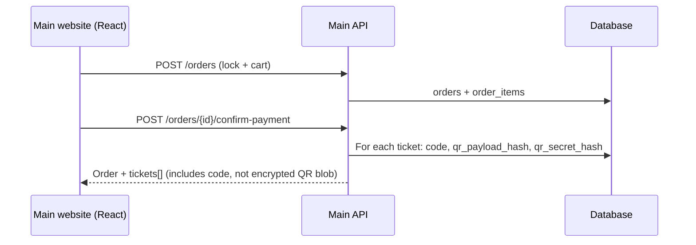
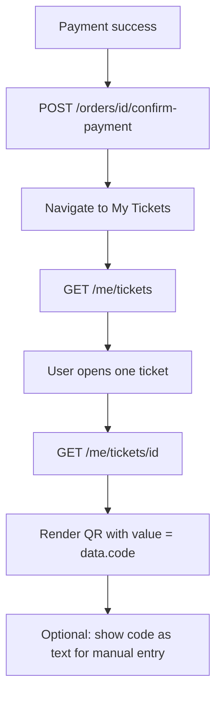

# Ticket QR codes — backend & React (TypeScript) handoff

**Date:** 2026-05-21  
**API base (main / buyer):** `https://<host>/api/v1/main`  
**API base (scanner app):** `https://<host>/api/v1/scanner`  
**Related:** [`SCANNER_API_ENDPOINTS.md`](SCANNER_API_ENDPOINTS.md), [`docs/sprints/PHASE-08-booking-and-payments.md`](sprints/PHASE-08-booking-and-payments.md)

---

## Executive summary

| Question | Answer |
|----------|--------|
| Does the API return a QR **image**? | **No.** Only text fields (`code`, `signed_qr_payload`). |
| Who **draws** the QR? | **Frontend** (React), using a client library. |
| What string should the **buyer** QR encode for **gate scan**? | **`ticket.code`** (e.g. `TIC-6ZAZYTFABRQBUX`). |
| What does the **scanner** send? | `ticket_code` = same `ticket.code` string. |
| Which API “generates” QR data? | **Issue:** `POST …/orders/{id}/confirm-payment` (writes DB). **Display:** `GET …/me/tickets/{id}` (adds `signed_qr_payload`). |

---

## 1. Backend does not render QR images

The API stores **hashes** and **metadata** at ticket issue time. It does **not** call `simplesoftwareio/simple-qrcode` for tickets.

`simplesoftwareio/simple-qrcode` is used elsewhere (e.g. **2FA setup** SVG in `TwoFactorService`), not for event tickets.

**Implication for React:** install a QR library and render locally, for example:

- [`qrcode.react`](https://www.npmjs.com/package/qrcode.react) — common in React
- or `qr-code-styling` if you need logos / styling

```bash
npm install qrcode.react
# types often bundled; if not: npm install -D @types/qrcode.react
```

---

## 2. Data model (what exists on each ticket)

After payment, each row in `tickets` includes:

| Column | Purpose | Example |
|--------|---------|---------|
| `id` | Internal numeric id | `42` |
| `code` | **Public ticket reference** (unique globally) | `TIC-6ZAZYTFABRQBUX` |
| `event_id` | Event FK | `18` |
| `status` | Lifecycle | `active`, `gifted`, `used`, … |
| `qr_payload_hash` | SHA-256 of **issue-time** encrypted blob | 64-char hex |
| `qr_secret_hash` | HMAC-SHA256 of issue-time **plaintext** with `APP_KEY` | 64-char hex |
| `qr_rotation_count` | Reserved for future rotation | `0` |

**Ticket `code` format (server-generated):**

```text
TIC-{14 uppercase alphanumeric characters}
```

Example: `TIC-6ZAZYTFABRQBUX`

Source:

```175:175:app/Domains/Booking/Services/BookingService.php
                    'code' => 'TIC-' . Str::upper(Str::random(14)),
```

---

## 3. When QR-related data is created (issue flow)

Tickets are created when payment is confirmed, not at order creation.



### APIs involved

| Step | Method | Path | Auth |
|------|--------|------|------|
| Create order | `POST` | `/api/v1/main/orders` | Bearer `app:main_website` |
| Confirm payment (issues tickets) | `POST` | `/api/v1/main/orders/{id}/confirm-payment` | Bearer |
| Order detail (optional) | `GET` | `/api/v1/main/orders/{id}` | Bearer |
| List tickets | `GET` | `/api/v1/main/me/tickets` | Bearer |
| **Ticket detail + display payload** | `GET` | `/api/v1/main/me/tickets/{id}` | Bearer |

### Issue-time internal payload (server only)

On each ticket row the server builds:

1. **Plaintext** (not returned in API responses):

   ```text
   tic-{order.reference}.{event_id}.{random8}
   ```

   Example plaintext: `tic-ORD-20260520-ABC.18.x7k2m9pq`

2. **Ciphertext:** `Crypt::encryptString(plaintext)` (Laravel `APP_KEY`)

3. **Stored hashes:**
   - `qr_payload_hash` = `sha256(ciphertext)`
   - `qr_secret_hash` = `hash_hmac('sha256', plaintext, APP_KEY)`

```172:186:app/Domains/Booking/Services/BookingService.php
                $payload = "tic-{$order->reference}.{$order->event_id}." . Str::random(8);
                $encrypted = Crypt::encryptString($payload);
                // ...
                    'qr_payload_hash' => hash('sha256', $encrypted),
                    'qr_secret_hash' => hash_hmac('sha256', $payload, (string) config('app.key')),
```

**Important:** The **encrypted issue-time string is never exposed** on `confirm-payment` or list endpoints. Only hashes are stored.

---

## 4. Display-time payload (`signed_qr_payload`)

When the buyer opens a single ticket, the API adds a **second** encrypted string for display:

**`GET /api/v1/main/me/tickets/{id}`**

```88:90:app/Http/Controllers/Api/V1/Main/Booking/MainBookingController.php
        $payload = Crypt::encryptString("tic-{$ticket->code}.{$ticket->event_id}.{$ticket->id}");

        return response()->json(['data' => array_merge($ticket->toArray(), ['signed_qr_payload' => $payload])]);
```

| Field | Plaintext before encrypt | Matches `qr_payload_hash`? |
|-------|--------------------------|----------------------------|
| Issue-time (DB) | `tic-{orderRef}.{eventId}.{random8}` | ✅ (this is what was hashed) |
| `signed_qr_payload` (GET show) | `tic-{code}.{eventId}.{ticketId}` | ❌ **Different plaintext** |

So:

- `signed_qr_payload` is a **long opaque string** (Laravel encryption, base64-like).
- It is **not** the same ciphertext as stored in `qr_payload_hash` at issue.
- `POST /api/v1/main/tickets/{ticketId}/validate` with `signed_qr_payload` will return **`valid: false`** today.

### Example response shape

```json
{
  "data": {
    "id": 42,
    "code": "TIC-6ZAZYTFABRQBUX",
    "order_id": 10,
    "event_id": 18,
    "status": "active",
    "seat_label_cache": "A-12",
    "type_name_cache": "VIP",
    "event_title_cache": "Summer Concert",
    "price_paid": "150.00",
    "signed_qr_payload": "eyJpdiI6Ik...very-long-string...",
    "created_at": "2026-05-20T12:00:00.000000Z",
    "updated_at": "2026-05-20T12:00:00.000000Z"
  }
}
```

`GET /api/v1/main/me/tickets` (paginated list) returns ticket rows **without** `signed_qr_payload` — fetch detail per ticket when showing the QR screen.

---

## 5. Validation API (optional / not aligned with show payload)

**`POST /api/v1/main/tickets/{ticketId}/validate`**  
Public route (no Sanctum in `routes/api_main.php`).

| Body field | Type | Description |
|------------|------|-------------|
| `qr_payload` | string | Must be the **exact issue-time ciphertext** whose SHA-256 equals `qr_payload_hash` |

```257:263:app/Http/Controllers/Api/V1/Main/Booking/MainBookingController.php
        $valid = hash('sha256', (string) $data['qr_payload']) === $ticket->qr_payload_hash;
```

Because issue-time ciphertext is **not** returned to the client, this endpoint is only useful if the backend later exposes that blob or aligns `signed_qr_payload` with issue hashes. **Do not rely on it from the buyer app with `signed_qr_payload` today.**

---

## 6. Gate scanning (scanner app — separate React or native client)

Scanner APIs live under `/api/v1/scanner`. They resolve tickets by **`code`**, not by decrypting QR.

**`POST /api/v1/scanner/scans`**

```json
{
  "event_id": 18,
  "ticket_code": "TIC-6ZAZYTFABRQBUX",
  "device_id": 3
}
```

```65:65:app/Domains/Scanners/Services/ScannerService.php
        $ticket = Ticket::query()->where('code', (string) $data['ticket_code'])->first();
```

Offline cache: **`GET /api/v1/scanner/events/{eventId}/manifest`** returns all valid `code` values for the event.

Full scanner contract: [`SCANNER_API_ENDPOINTS.md`](SCANNER_API_ENDPOINTS.md).

---

## 7. What the React main website should do

### 7.1 Recommended QR content (gate entry)

Encode **`ticket.code`** in the QR matrix.

```ts
// Value passed to QR component — MUST be ticket.code for scanner compatibility
const qrValue: string = ticket.code; // e.g. "TIC-6ZAZYTFABRQBUX"
```

**Do not** encode only `signed_qr_payload` for entry unless the scanner app is updated to decrypt/parse it (not supported today).

### 7.2 TypeScript types

```ts
export type TicketStatus =
  | 'active'
  | 'auction'
  | 'gifted'
  | 'used'
  | 'expired'
  | 'cancelled'
  | 'refunded';

export interface Ticket {
  id: number;
  code: string;
  order_id: number;
  order_reference: string;
  holder_user_id: number | null;
  event_id: number;
  occurrence_id: number | null;
  ticket_type_id: number | null;
  seat_id: number | null;
  status: TicketStatus;
  price_paid: string;
  event_title_cache: string | null;
  seat_label_cache: string | null;
  type_name_cache: string | null;
  venue_cache: string | null;
  city_cache: string | null;
  starts_at_cache: string | null;
  ends_at_cache: string | null;
  used_at: string | null;
  created_at: string;
  updated_at: string;
}

/** Present only on GET /me/tickets/{id} — do not use for scanner ticket_code */
export interface TicketDetail extends Ticket {
  signed_qr_payload: string;
}

export interface TicketListResponse {
  data: Ticket[];
  // plus Laravel pagination meta if using default paginate()
  current_page?: number;
  last_page?: number;
  per_page?: number;
  total?: number;
}

export interface TicketDetailResponse {
  data: TicketDetail;
}
```

### 7.3 API client helpers

```ts
const API_BASE = import.meta.env.VITE_API_URL ?? 'https://myticket-api.kat-jr.com/api/v1/main';

async function apiGet<T>(path: string, token: string): Promise<T> {
  const res = await fetch(`${API_BASE}${path}`, {
    headers: {
      Authorization: `Bearer ${token}`,
      Accept: 'application/json',
    },
  });
  if (!res.ok) throw new Error(await res.text());
  return res.json() as Promise<T>;
}

export function fetchMyTickets(token: string, page = 1) {
  return apiGet<TicketListResponse>(`/me/tickets?page=${page}`, token);
}

export function fetchTicketForQr(token: string, ticketId: number) {
  return apiGet<TicketDetailResponse>(`/me/tickets/${ticketId}`, token);
}
```

Auth: Sanctum bearer token with ability / app scope **`main_website`** (same as other main routes).

### 7.4 React component example (`qrcode.react`)

```tsx
import { QRCodeSVG } from 'qrcode.react';
import { useEffect, useState } from 'react';
import { fetchTicketForQr, type TicketDetail } from '../api/tickets';

type Props = {
  ticketId: number;
  accessToken: string;
};

export function TicketQrCard({ ticketId, accessToken }: Props) {
  const [ticket, setTicket] = useState<TicketDetail | null>(null);
  const [error, setError] = useState<string | null>(null);

  useEffect(() => {
    let cancelled = false;
    (async () => {
      try {
        const { data } = await fetchTicketForQr(accessToken, ticketId);
        if (!cancelled) setTicket(data);
      } catch (e) {
        if (!cancelled) setError(e instanceof Error ? e.message : 'Failed to load ticket');
      }
    })();
    return () => {
      cancelled = true;
    };
  }, [ticketId, accessToken]);

  if (error) return <p role="alert">{error}</p>;
  if (!ticket) return <p>Loading ticket…</p>;

  // Scanner reads this exact string
  const scanValue = ticket.code;

  return (
    <section aria-label="Ticket QR code">
      <QRCodeSVG
        value={scanValue}
        size={256}
        level="M"
        includeMargin
      />
      <p>
        <strong>Ticket code:</strong> {ticket.code}
      </p>
      <p>
        <strong>Event:</strong> {ticket.event_title_cache ?? `#${ticket.event_id}`}
      </p>
      {ticket.seat_label_cache && (
        <p>
          <strong>Seat:</strong> {ticket.seat_label_cache}
        </p>
      )}
      <p>
        <strong>Status:</strong> {ticket.status}
      </p>
      {ticket.status === 'used' && (
        <p className="text-amber-700">This ticket has already been scanned.</p>
      )}
    </section>
  );
}
```

### 7.5 UX flow



1. After **`confirm-payment`**, read `data.tickets[].code` from the order if the response includes tickets (or refetch list).
2. **Wallet / list screen:** show event title, status, seat; tap opens detail.
3. **Detail screen:** call **`GET /me/tickets/{id}`**, render QR from **`code`**.
4. **Brightness:** encourage high screen brightness at the gate (QR contrast).
5. **Status `used`:** show “Already used” and still show code (staff may need to see duplicate scan result on their device).

### 7.6 Order confirmation screen

If the order response embeds tickets:

```ts
interface OrderWithTickets {
  id: number;
  reference: string;
  payment_status: string;
  tickets?: Array<{ id: number; code: string; status: string }>;
}
```

You can show a QR immediately after payment using `tickets[0].code` without waiting for the detail endpoint — still call detail for full caches (seat label, etc.).

### 7.7 What to do with `signed_qr_payload`

| Use | Recommendation |
|-----|----------------|
| Encode in gate QR | ❌ Not supported by scanner API today |
| Show as copyable “security blob” | ⚠️ Confusing for users — avoid |
| Future signed / offline verify | 🔜 Requires backend alignment |
| `validate` endpoint | ❌ Will not match until backend unifies payloads |

Store it in state if the API returns it, but **prefer `code` for all scanning scenarios**.

### 7.8 Email / PDF

Order invoice email lists **`ticket.code`** in plain text only (no QR image from server). The app should remain the source of truth for QR display.

---

## 8. Scanner React app (if you build it in TypeScript)

Separate base URL and token scope: **`app:scanner`**.

```ts
// After scanning QR string from camera:
const scannedText = decodeQrFromCamera(); // e.g. "TIC-6ZAZYTFABRQBUX"

await fetch(`${SCANNER_API}/scans`, {
  method: 'POST',
  headers: {
    Authorization: `Bearer ${scannerToken}`,
    'Content-Type': 'application/json',
  },
  body: JSON.stringify({
    event_id: selectedEventId,
    ticket_code: scannedText.trim(),
    device_id: registeredDeviceId,
  }),
});
```

Trim whitespace; QR readers sometimes append newlines.

Handle `result` in response: `ok` | `duplicate` | `invalid` | `expired` | `wrong_event`.

---

## 9. Security notes for frontend

1. **`code` is a secret credential** — treat like a boarding pass barcode; avoid sharing screenshots publicly.
2. Do not log full `signed_qr_payload` or tokens in production analytics.
3. Prefer **HTTPS** only for API calls.
4. Cache ticket detail in memory; avoid localStorage unless encrypted (codes are gate credentials).

---

## 10. Known gaps / future backend work

| Gap | Impact | Possible fix |
|-----|--------|----------------|
| Issue plaintext ≠ show plaintext | `validate` + `signed_qr_payload` mismatch | Unify on `tic-{code}.{eventId}.{ticketId}` at issue and show |
| Issue ciphertext not in API | Client cannot call `validate` | Return `qr_ciphertext` once at issue or on show |
| PHASE-08 mentions HMAC offline scan | Not implemented in `ScannerService` | Device secret + offline verify |
| `qr_rotation_count` unused | No rotating QR yet | Job to re-issue ciphertext |

Track these with backend before building client-only workarounds.

---

## 11. Quick reference table

| App | QR encodes | API |
|-----|------------|-----|
| Main website (buyer) | `ticket.code` | `GET /me/tickets/{id}` |
| Scanner app | Reads `ticket.code` | `POST /scanner/scans` |
| Validate (broken for show payload) | issue-time ciphertext | `POST /main/tickets/{id}/validate` |

---

## 12. Checklist for frontend PRs

- [ ] QR library renders **`data.code`**, not only `signed_qr_payload`
- [ ] Ticket detail fetched with **`GET /me/tickets/{id}`** before showing QR
- [ ] List view works with **`GET /me/tickets`** (no `signed_qr_payload` required)
- [ ] After payment, user can reach QR with **`code`** from order or list
- [ ] `used` / `cancelled` / `refunded` tickets show clear status (no false “valid entry” copy)
- [ ] Scanner app (if any) sends **`ticket_code: scannedString`**

---

## 13. Related tests (for QA)

- `tests/Feature/Booking/BookingPaymentsFlowTest.php` — asserts `signed_qr_payload` on ticket show
- `tests/Feature/Scanners/ScannersFlowTest.php` — scans with `ticket.code`

Run locally:

```bash
php artisan test --filter=BookingPaymentsFlow
php artisan test --filter=ScannersFlow
```
