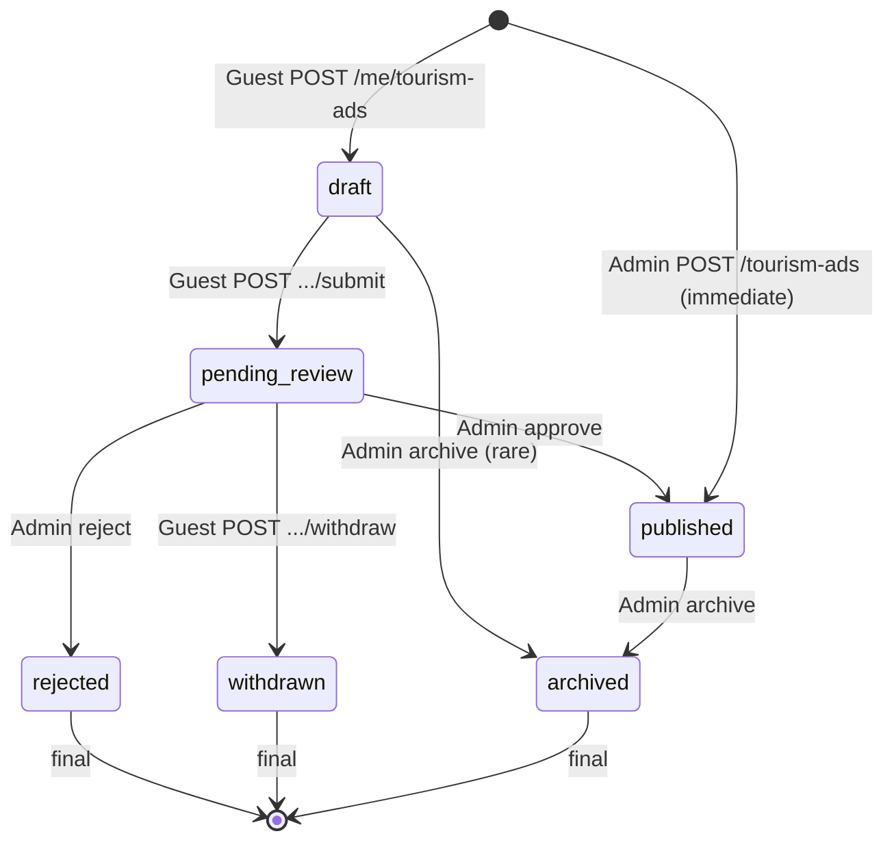
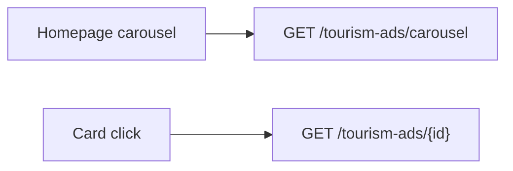
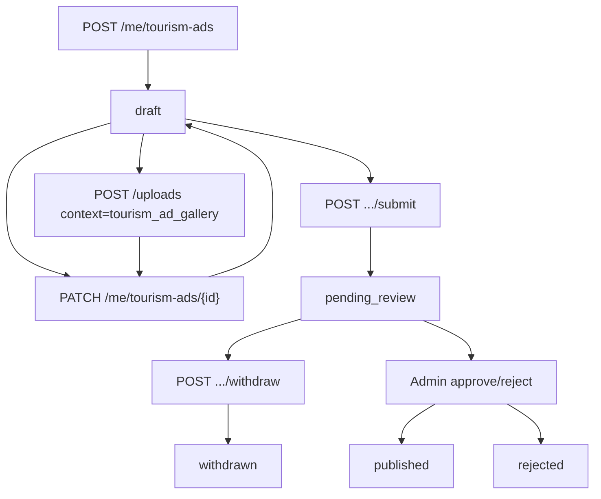
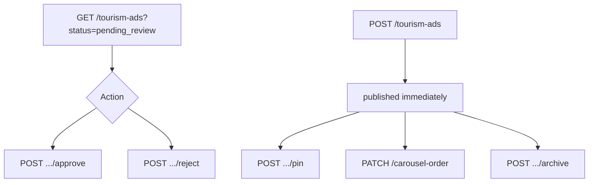

# Tourism Ads API — frontend implementation guide

**Date:** 2026-06-14  
**Audience:** Main website SPA (`https://myticket.kat-jr.com`) + Admin dashboard (`https://myticket-admin.kat-jr.com`)  
**Main API base:** `https://myticket-api.kat-jr.com/api/v1/main`  
**Admin API base:** `https://myticket-api.kat-jr.com/api/v1/admin`  
**Realtime:** [`socket-and-chat/frontend-realtime-integration-guide.md`](socket-and-chat/frontend-realtime-integration-guide.md)  
**Related:** [`frontend-handoff-vendor-api.md`](frontend-handoff-vendor-api.md) (similar guest submit pattern)

---

## Summary

| Platform | Who | Purpose |
|----------|-----|---------|
| **Main (public)** | Anyone | Carousel + published ad detail |
| **Main (guest)** | Logged-in user (`app:main`) | Create draft → submit for review → withdraw |
| **Admin** | Admin (`app:admin`) | CRUD, approve/reject, pin/reorder carousel, archive |

**Product rules**

- Admin-created ads are **published immediately** (no review queue).
- Guest submissions start as **draft**, move to **pending_review** on submit, then admin **approve** or **reject**.
- Guest may edit **draft only**. After submit: **withdraw** only. **Rejected** ads are final (no resubmit).
- One ad per location per guest: same `location_name` (case-insensitive) **or** coordinates within **100 m** of another non-withdrawn/non-rejected ad.
- Carousel shows `published` ads inside optional visibility window, ordered: `is_pinned DESC` → `carousel_position ASC` (nulls last) → `published_at DESC`.

---

## Authentication

| App | Login | Token ability | Middleware |
|-----|-------|---------------|------------|
| Main / guest | `POST /api/v1/main/auth/login` | `app:main` | `app.scope:main_website` |
| Admin | `POST /api/v1/admin/auth/login` | `app:admin` | `app.scope:admin_dashboard` |

```http
Authorization: Bearer <sanctum_token>
```

| HTTP | Meaning |
|------|---------|
| **401** | Missing/invalid token |
| **403** | Wrong app scope |
| **404** | Not found or not visible (public detail) |
| **422** | Validation or business-rule failure |

---

## Status lifecycle



| Status | Guest can edit? | In carousel? | Notes |
|--------|-----------------|--------------|-------|
| `draft` | Yes (`PATCH`) | No | Default for guest create |
| `pending_review` | No (withdraw only) | No | Awaits admin |
| `published` | No | Yes (if visible window) | Live |
| `rejected` | No | No | Shows `rejection_reason` |
| `withdrawn` | No | No | Guest cancelled review |
| `archived` | No | No | Admin unpublish |

**Allowed transitions** (enforced server-side):

| From | To |
|------|-----|
| `draft` | `pending_review`, `published`, `archived` |
| `pending_review` | `published`, `rejected`, `withdrawn` |
| `published` | `archived` |
| `rejected`, `withdrawn`, `archived` | *(none)* |

---

## Shared data shapes

### Opening hours (`opening_hours`)

All seven weekday keys are **required** on submit and admin create. Each day:

```json
{
  "opening_hours": {
    "mon": { "closed": false, "opens": "09:00", "closes": "18:00" },
    "tue": { "closed": false, "opens": "09:00", "closes": "18:00" },
    "wed": { "closed": false, "opens": "09:00", "closes": "18:00" },
    "thu": { "closed": false, "opens": "09:00", "closes": "18:00" },
    "fri": { "closed": false, "opens": "14:00", "closes": "22:00" },
    "sat": { "closed": false, "opens": "09:00", "closes": "22:00" },
    "sun": { "closed": true }
  }
}
```

- Weekday keys: `mon`, `tue`, `wed`, `thu`, `fri`, `sat`, `sun`
- Times: `HH:MM` (24h)
- When `closed: true`, `opens` / `closes` may be omitted

### Contact (`contact`)

At least **phone or email** required on submit and admin create:

```json
{
  "contact": {
    "phone": "+966500000001",
    "email": "tourism@example.com",
    "website": "https://example.com",
    "whatsapp": "+966500000002"
  }
}
```

### Services (`services`)

Free-text tags, 1–20 items, each max 80 chars:

```json
["guided tours", "snorkeling", "boat trips"]
```

### Media links (`media_links`)

Optional, max 10:

```json
[
  { "platform": "instagram", "url": "https://instagram.com/example" },
  { "platform": "website", "url": "https://example.com" }
]
```

Platform is a free string (e.g. `instagram`, `x`, `tiktok`, `website`).

### Gallery (`gallery_urls`)

Array of absolute URLs, 1–20 items. First item is the **cover** (`cover_image_url` in API responses).

Upload via `POST /api/v1/main/uploads` with `context=tourism_ad_gallery` (see § Upload flow).

---

## Standard error shapes

### Validation (`422`)

```json
{
  "message": "The given data was invalid.",
  "errors": {
    "description": ["The description field must be at least 50 characters."],
    "opening_hours.mon": ["Opens and closes times are required when not closed."]
  }
}
```

### Business rule (`422`, single message)

```json
{ "message": "You already have an ad for this location name." }
```

```json
{ "message": "You already have an ad within 100 meters of this location." }
```

```json
{ "message": "Only draft ads can be updated." }
```

```json
{ "message": "Rejected or withdrawn ads cannot be updated." }
```

```json
{ "message": "Only published ads can be pinned." }
```

---

# Main website — public (no auth)

Base: `https://myticket-api.kat-jr.com/api/v1/main`

### Flow



---

### `GET /tourism-ads/carousel`

Returns all **published** ads currently inside their visibility window.

**Success `200`**

```json
{
  "data": [
    {
      "id": 12,
      "location_name": "Red Sea Coral Bay",
      "latitude": "22.5960000",
      "longitude": "39.1180000",
      "description": "A beautiful coastal destination with diving and guided tours. A beautiful coastal destination with diving and guided tours. A beautiful coastal destination with diving and guided…",
      "services": ["guided tours", "snorkeling"],
      "opening_hours": { "mon": { "closed": false, "opens": "09:00", "closes": "18:00" } },
      "contact": { "phone": "+966500000001", "email": "tourism@example.com" },
      "media_links": [{ "platform": "instagram", "url": "https://instagram.com/example" }],
      "gallery_urls": ["https://myticket-api.kat-jr.com/storage/tourism/ads/gallery/abc.jpg"],
      "cover_image_url": "https://myticket-api.kat-jr.com/storage/tourism/ads/gallery/abc.jpg",
      "visibility_starts_at": null,
      "visibility_ends_at": null,
      "published_at": "2026-06-14T10:00:00+00:00",
      "is_pinned": true
    }
  ]
}
```

**Notes**

- `description` is truncated to ~200 chars in carousel items (full text on detail).
- Ordering: pinned first → manual `carousel_position` → newest `published_at`.

---

### `GET /tourism-ads/{id}`

Public detail for a single published, visible ad.

**Success `200`**

```json
{
  "data": {
    "id": 12,
    "location_name": "Red Sea Coral Bay",
    "latitude": "22.5960000",
    "longitude": "39.1180000",
    "description": "Full description text (min 50 chars on submit)…",
    "services": ["guided tours", "snorkeling"],
    "opening_hours": { },
    "contact": { },
    "media_links": [],
    "gallery_urls": ["https://…"],
    "cover_image_url": "https://…",
    "visibility_starts_at": null,
    "visibility_ends_at": null,
    "published_at": "2026-06-14T10:00:00+00:00",
    "is_pinned": false,
    "status": "published"
  }
}
```

**Errors**

| Code | When |
|------|------|
| **404** | Not published, not found, or outside visibility window |

---

# Main website — guest (`/me/tourism-ads`)

Auth: Bearer token with `app:main`.

### Flow



---

### `POST /me/tourism-ads`

Create a **draft**. All body fields are optional on create (defaults to `location_name: "Untitled location"`).

**Request body** (partial allowed — `draftRules`):

```json
{
  "location_name": "Red Sea Coral Bay",
  "latitude": 22.596,
  "longitude": 39.118,
  "description": "Optional while drafting…",
  "opening_hours": { },
  "services": ["snorkeling"],
  "contact": { "phone": "+966500000001" },
  "media_links": [],
  "gallery_urls": [],
  "visibility_starts_at": null,
  "visibility_ends_at": null
}
```

**Success `201`**

```json
{
  "data": { }
}
```

`data` uses the **detail** shape below (`status: "draft"`).

---

### `GET /me/tourism-ads`

List own ads (paginated).

**Query**

| Param | Type | Description |
|-------|------|-------------|
| `status` | string | Filter: `draft`, `pending_review`, `published`, etc. |
| `page` | integer | Page number |
| `per_page` | integer | 1–50 (default 20) |

**Success `200`** — Laravel paginator (**no** outer `{ data }` wrapper):

```json
{
  "current_page": 1,
  "data": [ { } ],
  "per_page": 20,
  "total": 3
}
```

Each item in `data[]` is the **detail** shape.

---

### `GET /me/tourism-ads/{id}`

Own ad detail (any status).

**Success `200`**: `{ "data": { …detail } }`

---

### `PATCH /me/tourism-ads/{id}`

Update **draft only**. Same partial body as create.

**Success `200`**: `{ "data": { …detail } }`

**Errors**

| Message | When |
|---------|------|
| `Only draft ads can be updated.` | Status ≠ `draft` |

---

### `POST /me/tourism-ads/{id}/submit`

Validates full publish rules + uniqueness, then `draft` → `pending_review`.

**Request body:** empty

**Success `200`**: `{ "data": { …detail, "status": "pending_review", "submitted_at": "…" } }`

**Required fields at submit** (same as admin create):

- `location_name`, `latitude`, `longitude`
- `description` (min 50, max 5000)
- `opening_hours` (all weekdays)
- `services` (1–20 tags)
- `contact.phone` or `contact.email`
- `gallery_urls` (min 1)

**Side effect:** broadcasts `.tourism_ad.status_changed` on `private-admin.tourism_ads` (admin queue refresh).

---

### `POST /me/tourism-ads/{id}/withdraw`

`pending_review` → `withdrawn`.

**Success `200`**: `{ "data": { …detail, "status": "withdrawn" } }`

---

### Detail shape (guest + admin)

Used in `GET`, `POST`, `PATCH` responses:

```json
{
  "id": 12,
  "user_id": 42,
  "created_by_user_id": 42,
  "reviewed_by_user_id": null,
  "source": "guest",
  "status": "draft",
  "location_name": "Red Sea Coral Bay",
  "latitude": "22.5960000",
  "longitude": "39.1180000",
  "description": "…",
  "opening_hours": { },
  "services": ["guided tours"],
  "contact": { },
  "media_links": [],
  "gallery_urls": ["https://…"],
  "cover_image_url": "https://…",
  "visibility_starts_at": null,
  "visibility_ends_at": null,
  "rejection_reason": null,
  "carousel_position": null,
  "is_pinned": false,
  "submitted_at": null,
  "reviewed_at": null,
  "published_at": null,
  "created_at": "2026-06-14T09:00:00+00:00",
  "updated_at": "2026-06-14T09:00:00+00:00",
  "user": null,
  "created_by": null,
  "reviewed_by": null
}
```

Admin list/detail may include nested `user`, `created_by`, `reviewed_by`:

```json
"user": { "id": 42, "full_name": "Guest User", "email": "guest@example.com" }
```

---

# Upload flow (gallery images)

**Endpoint:** `POST https://myticket-api.kat-jr.com/api/v1/main/uploads`  
**Auth:** `app:main`

**Request:** `multipart/form-data`

| Field | Value |
|-------|-------|
| `file` | Image or PDF (max 12 MB) |
| `context` | `tourism_ad_gallery` |

**Success `201`**

```json
{
  "data": {
    "url": "https://myticket-api.kat-jr.com/storage/tourism/ads/gallery/xyz.jpg",
    "content_type": "image/jpeg",
    "size_bytes": 245000
  }
}
```

Append returned `url` to `gallery_urls` on draft `PATCH`, then submit.

---

# Admin dashboard (`/tourism-ads`)

Auth: Bearer token with `app:admin`.

### Flow



**Dashboard counters** (existing endpoints):

- `GET /api/v1/admin/dashboard/summary` → `data.tourism_ads.pending_review`
- `GET /api/v1/admin/dashboard/platform-counters` → `data.tourism_ads_pending_review`
- `GET /api/v1/admin/dashboard/pending-actions` → `data.tourism_ads_pending_review[]` (latest 10)

---

### `GET /tourism-ads`

Paginated list of all ads.

**Query**

| Param | Type | Description |
|-------|------|-------------|
| `status` | string | e.g. `pending_review`, `published` |
| `source` | string | `guest` or `admin` |
| `page`, `per_page` | integer | Pagination |

**Success `200`**

```json
{
  "data": {
    "current_page": 1,
    "data": [ { …detail with user/created_by } ],
    "per_page": 20,
    "total": 15
  }
}
```

Note: paginator is **wrapped** in `{ "data": … }` (unlike guest list).

---

### `GET /tourism-ads/{id}`

**Success `200`**: `{ "data": { …detail } }`

---

### `POST /tourism-ads`

Create and **publish immediately** (`status: published`, `published_at: now`).

**Request body** — full publish rules (see § Shared data shapes).

**Success `201`**: `{ "data": { …detail, "status": "published", "source": "admin" } }`

---

### `PATCH /tourism-ads/{id}`

Update any ad except `rejected` or `withdrawn`. Partial body allowed.

**Success `200`**: `{ "data": { …detail } }`

---

### `POST /tourism-ads/{id}/approve`

`pending_review` → `published`.

**Request body:** empty

**Success `200`**: `{ "data": { …detail, "status": "published" } }`

**Side effects**

- In-app notification (`kind: tourism_ad_approved`) to submitter
- Realtime `.tourism_ad.status_changed` on submitter `private-user.{id}` + `private-admin.tourism_ads`

---

### `POST /tourism-ads/{id}/reject`

**Request body**

```json
{
  "reason": "Incomplete contact information or misleading description."
}
```

| Field | Rules |
|-------|-------|
| `reason` | required, string, max 1000 |

**Success `200`**: `{ "data": { …detail, "status": "rejected", "rejection_reason": "…" } }`

**Side effects:** `tourism_ad_rejected` notification + realtime (same channels as approve).

---

### `POST /tourism-ads/{id}/archive`

Unpublish / remove from carousel (`published` → `archived`). Clears pin and carousel position.

**Success `200`**: `{ "data": { …detail, "status": "archived" } }`

There is **no hard DELETE** endpoint — use archive for audit trail.

---

### `POST /tourism-ads/{id}/pin`

Pin a published ad for carousel priority.

**Request body** (optional)

```json
{ "position": 0 }
```

**Success `200`**: `{ "data": { …detail, "is_pinned": true, "carousel_position": 0 } }`

---

### `POST /tourism-ads/{id}/unpin`

**Success `200`**: `{ "data": { …detail, "is_pinned": false, "carousel_position": null } }`

---

### `PATCH /tourism-ads/carousel-order`

Bulk reorder pinned published ads.

**Request body**

```json
{
  "items": [
    { "id": 12, "position": 0 },
    { "id": 8, "position": 1 }
  ]
}
```

**Success `200`**

```json
{
  "data": [
    { …detail for id 12 },
    { …detail for id 8 }
  ]
}
```

Each item is set `is_pinned: true` with the given `carousel_position`.

---

# Realtime

Subscribe using Laravel Echo (see socket guide). **Always reconcile with REST** after push.

### Channels

| Channel | Who | Purpose |
|---------|-----|---------|
| `private-user.{userId}` | Guest submitter | Status updates on ad detail / list |
| `private-admin.tourism_ads` | Admin users | Review queue + carousel admin refresh |

### Event

**Listener:** `.tourism_ad.status_changed`

**Envelope**

```json
{
  "type": "tourism_ad.status_changed",
  "payload": {
    "id": 12,
    "user_id": 42,
    "location_name": "Red Sea Coral Bay",
    "from_status": "pending_review",
    "to_status": "published",
    "status": "published",
    "rejection_reason": null,
    "reviewed_at": "2026-06-14T11:00:00+00:00",
    "published_at": "2026-06-14T11:00:00+00:00"
  },
  "occurred_at": "2026-06-14T11:00:00+00:00"
}
```

### When fired

| Action | Channels |
|--------|----------|
| Guest submit | `admin.tourism_ads` only |
| Admin approve / reject | `user.{submitterId}` + `admin.tourism_ads` |

### Reconcile REST

| UI | On event |
|----|----------|
| Guest ad detail | `GET /me/tourism-ads/{id}` |
| Guest list | `GET /me/tourism-ads` |
| Admin queue | `GET /tourism-ads?status=pending_review` |
| Public carousel | `GET /tourism-ads/carousel` |

### In-app notifications (bell)

| Kind | When | `href` |
|------|------|--------|
| `tourism_ad_approved` | Admin approve | Main `/me/tourism-ads/{id}` |
| `tourism_ad_rejected` | Admin reject | Main `/me/tourism-ads/{id}` |

`data.tourism_ad_id`, `data.status`, and on reject `data.rejection_reason`.

---

# Frontend checklists

### Main website (public)

- [ ] Homepage carousel: `GET /tourism-ads/carousel`
- [ ] Detail page: `GET /tourism-ads/{id}`
- [ ] Handle empty carousel and 404 on expired/hidden ads
- [ ] Map pin from `latitude` / `longitude`
- [ ] Cover image: `cover_image_url` or `gallery_urls[0]`

### Main website (guest)

- [ ] Multi-step form: draft saves via `POST` / `PATCH`
- [ ] Gallery: upload with `context=tourism_ad_gallery`, collect URLs
- [ ] Opening hours editor for all 7 weekdays
- [ ] Submit button calls `POST .../submit` (disable after `pending_review`)
- [ ] Withdraw on pending ads only
- [ ] Show `rejection_reason` read-only; hide edit for rejected
- [ ] Echo: listen `.tourism_ad.status_changed` on `user.{id}`
- [ ] Notification inbox: handle `tourism_ad_approved` / `tourism_ad_rejected`

### Admin dashboard

- [ ] Queue tile from `tourism_ads_pending_review` counter
- [ ] List filter `?status=pending_review&source=guest`
- [ ] Approve / reject with reason modal
- [ ] Create ad form (publishes immediately — no separate approve step)
- [ ] Carousel manager: pin, unpin, drag → `PATCH /carousel-order`
- [ ] Archive instead of delete
- [ ] Echo: subscribe `admin.tourism_ads` for `.tourism_ad.status_changed`

### Deploy (API)

- [ ] Run migrations: `tourism_ads` table + notification kinds
- [ ] `php artisan config:cache` after deploy

---

## Migrations

| File | Purpose |
|------|---------|
| `2026_06_14_000001_create_tourism_ads_table.php` | `tourism_ads` table |
| `2026_06_14_000002_add_tourism_ad_kinds_to_notifications_kind_enum.php` | `tourism_ad_approved`, `tourism_ad_rejected` |
