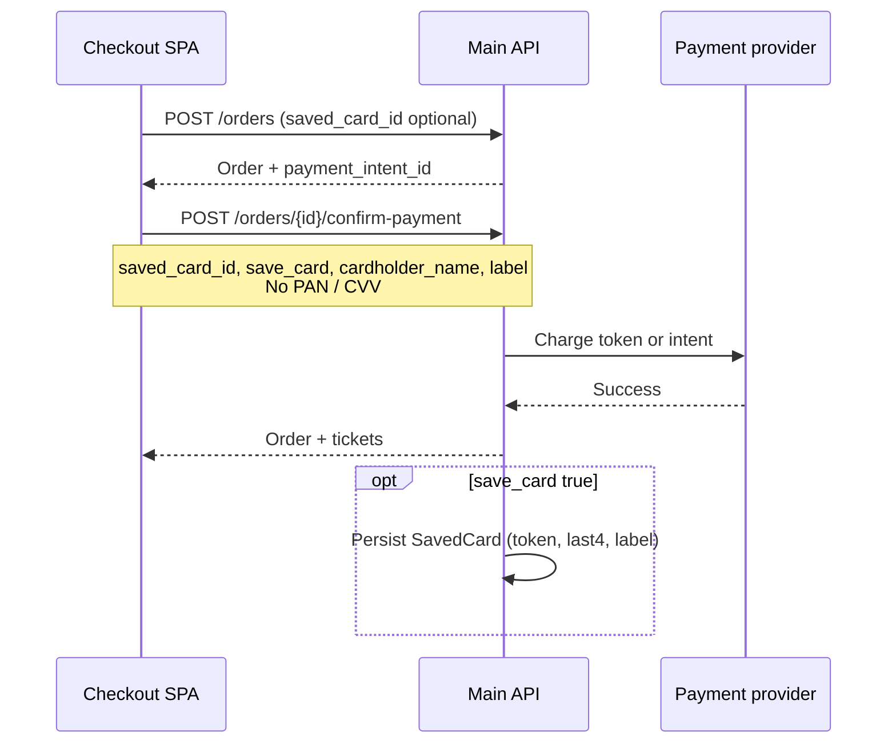

# Security review: checkout & saved cards

**Date:** 2026-06-16  
**Scope:** Uncommitted frontend changes for card nickname, save-card UX, and checkout payment flow (`CheckoutPage`, `CreditCard`, saved-card types, confirm-payment body).  
**Method:** Static review of diff + trace of payment/saved-card API contracts in this repo (no backend source in this workspace).

---

## Executive summary

The checkout save-card design is **directionally correct**: sensitive card data stays in React memory for UX/validation, confirm-payment sends **metadata only** (`saved_card_id`, `save_card`, `cardholder_name`, `label`), and saved cards are loaded from **auth-scoped** `GET /me/saved-cards`.

**One actionable authorization risk** remains: **`saved_card_id` IDOR** if the API does not verify that the card belongs to the authenticated user. The frontend cannot fully prevent this; the backend must enforce ownership on every endpoint that accepts `saved_card_id`.

No medium/high/critical issues were found in the changed frontend alone **beyond that standard payment IDOR pattern**, assuming the backend is implemented correctly.

---

## Flow under review



**Frontend files (primary):**

| Area | Path |
|------|------|
| Checkout pay step | `src/pages/checkout/CheckoutPage.tsx` |
| Card preview | `src/components/checkout/CreditCard.tsx`, `CheckoutPaymentCards.tsx` |
| Types | `src/api/types/order.ts`, `src/api/types/savedCard.ts` |
| Validation schemas | `src/schemas/payment.ts`, `src/schemas/order.ts` |
| Auction buy-now (comparison) | `src/pages/auction/AuctionEventPage.tsx` |
| Saved-card API hooks | `src/api/endpoints/savedCards.ts` |

**Backend endpoints (contract from `API_REFERENCE.md`):**

| Method | Path | Accepts `saved_card_id` |
|--------|------|-------------------------|
| `POST` | `/orders` | Yes (`CreateOrderRequest`) |
| `POST` | `/orders/{id}/confirm-payment` | Yes (`ConfirmOrderPaymentRequest`) |
| `POST` | Auction buy-now | Yes (`BuyNowRequest`) |
| `GET` | `/me/saved-cards` | — (list own cards) |
| `DELETE` | `/me/saved-cards/{id}` | — (delete own card) |

---

## Findings

| # | Severity | Location | Finding | Status |
|---|----------|----------|---------|--------|
| 1 | **Medium** (if backend omits check) | `POST /orders`, `POST /orders/{id}/confirm-payment`, auction buy-now | **`saved_card_id` IDOR** — client can send another user’s card id | Backend: **required** · Frontend: **partially mitigated** |
| 2 | Low | `src/schemas/payment.ts` | `confirmPaymentSchema` missing `save_card`, `cardholder_name`, `label` | Open |
| 3 | Low (pre-existing) | `src/pages/auction/AuctionEventPage.tsx` | New-card auction buy-now sends **PAN + CVV** in request body | Open (production) |
| 4 | Info | Checkout card inputs | PAN/CVV held in React state (in-memory only) | Acceptable for demo; PSP required for production PCI |
| 5 | Info | `API_REFERENCE.md` §13 | Docs omit `label` on `SavedCard` / confirm-payment | Docs drift |

---

## Finding 1 — `saved_card_id` IDOR (Medium, conditional)

### Risk

An authenticated attacker could charge **another user’s** stored payment method on their own order by supplying a victim’s `saved_card_id` on:

- `POST /orders`
- `POST /orders/{id}/confirm-payment`
- Auction buy-now (if applicable)

Impact: unauthorized charges, account abuse, regulatory exposure.

### Attack path

1. Attacker signs in as themselves.
2. Obtains or guesses a victim `saved_card_id` (e.g. sequential ids, leaked logs).
3. Tampering via DevTools or proxy: set `saved_card_id` on create-order and/or confirm-payment.
4. If the server does not verify `saved_cards.user_id === auth user`, payment may succeed with the victim’s card.

### Backend fix (required)

Enforce ownership **on every code path** that reads `saved_card_id`. Treat untrusted client ids like any other user input.

**Pseudocode (Laravel-style):**

```php
// Before charging or attaching a card to an order
$card = SavedCard::where('id', $request->saved_card_id)
    ->where('user_id', $request->user()->id)
    ->first();

if (!$card) {
    abort(404); // or 403 — do not reveal whether the id exists for another user
}

// Use $card->gateway_token only — never trust client PAN/CVV when saved_card_id is set
```

**Checklist:**

- [ ] `POST /orders` — if `saved_card_id` present, resolve only from `saved_cards` where `user_id = auth()->id()`.
- [ ] `POST /orders/{id}/confirm-payment` — same check; ignore client id if order already has a validated card reference.
- [ ] Auction buy-now — same check.
- [ ] `DELETE /me/saved-cards/{id}` — already scoped (use as reference implementation).
- [ ] Return **404 or 403** on mismatch; do not leak cross-user existence.
- [ ] Integration test: User A cannot pay with User B’s `saved_card_id`.
- [ ] Log failed ownership attempts (audit / fraud monitoring).

**Suggested API errors:**

```json
{ "message": "Saved card not found.", "code": "saved_card_not_found" }
```

HTTP **404** preferred so attackers cannot distinguish “exists for someone else” vs “invalid id”.

### Frontend fix (defense in depth)

The SPA cannot stop a determined client from forging requests. It should still avoid sending stale or unvalidated ids.

**Already implemented (2026-06-16):**

- `usingSavedCard` is true only when `selectedSavedCard` resolves from `GET /me/saved-cards` list.
- Before pay: if `selectedSavedCardId` is set but card is not in the list → block with user message.
- `orderBody.saved_card_id` and `confirmBody.saved_card_id` use `selectedSavedCard.id` from the resolved object, not raw tamperable state alone.

**Reference — checkout guard:**

```ts
// src/pages/checkout/CheckoutPage.tsx
if (selectedSavedCardId !== null && !selectedSavedCard) {
  setPaymentErrorMessage(
    'That saved card is no longer available. Choose another card or use a new one.',
  );
  return;
}
if (selectedSavedCard) {
  confirmBody.saved_card_id = selectedSavedCard.id;
}
```

**Auction pattern (already stricter on submit):**

```ts
// src/pages/auction/AuctionEventPage.tsx
const card = savedCards.find((c) => String(c.id) === String(effectiveBuySavedCardId));
if (!card) {
  setBuyError('That saved card is no longer available. Choose another card or use a new card.');
  return;
}
```

**Optional hardening:**

- [ ] Invalidate `selectedSavedCardId` when `useListSavedCardsQuery` refetches and id disappears.
- [ ] Never accept `saved_card_id` from URL/query params.
- [ ] E2E test: tampered id in state shows error before API call.

---

## Finding 2 — `confirmPaymentSchema` drift (Low)

### Risk

`confirmPaymentSchema` in `src/schemas/payment.ts` only documents `payment_intent_id`, `three_ds_token`, and `saved_card_id`. The checkout flow also sends `save_card`, `cardholder_name`, and `label`. The schema is not wired into the RTK mutation today, so this is **maintainability / future regression** risk, not an active bypass.

### Frontend fix

Extend the schema and optionally validate before `confirmOrderPayment`:

```ts
// src/schemas/payment.ts
export const confirmPaymentSchema = yup.object({
  payment_intent_id: yup.string().notRequired(),
  three_ds_token: yup.string().notRequired(),
  saved_card_id: yup.mixed<string | number>().notRequired(),
  save_card: yup.boolean().notRequired(),
  cardholder_name: yup.string().trim().max(120).notRequired(),
  label: yup.string().trim().max(24).notRequired(),
}).strict();
```

### Backend fix

- Document accepted confirm-payment fields in OpenAPI / `API_REFERENCE.md`.
- Validate: `save_card` only when authenticated; reject PAN/CVV keys on this endpoint with **422**.
- When `save_card: true`, persist `cardholder_name` and `label` on the new `SavedCard` row (token from PSP, never full PAN).

---

## Finding 3 — Auction buy-now sends PAN/CVV (Low, pre-existing)

### Risk

For **new cards**, auction buy-now still posts raw card data:

```ts
// src/pages/auction/AuctionEventPage.tsx
card_number: digits,
cvv: paymentForm.cvv,
```

This increases PCI scope (browser → your API → PSP). Checkout confirm-payment **does not** do this; only checkout was in scope for the recent UI work.

### Backend fix

- Prefer **payment intent + client-side tokenization** (Stripe Elements, Moyasar, HyperPay hosted fields, etc.).
- API should accept `payment_method_id` / `token` instead of `card_number` + `cvv` in production.
- If simulation remains in staging, restrict to non-production environments.

### Frontend fix

- Migrate auction new-card flow to the same PSP SDK as checkout.
- Remove `card_number` and `cvv` from `BuyNowRequest` in production builds.
- Mirror checkout: `save_card` + `label` + `cardholder_name` only on success path.

---

## Finding 4 — In-memory PAN/CVV on checkout (Info)

### Current behavior

Checkout collects PAN/CVV in controlled inputs for Luhn/expiry/CVV validation and live card preview. Data lives in `useState` only — **not** `localStorage`, `sessionStorage`, or URL.

Confirm-payment body sends **no** PAN/CVV:

```ts
// src/pages/checkout/CheckoutPage.tsx
if (paymentForm.saveCard && !usingSavedCard && user) {
  confirmBody.save_card = true;
  if (holder) confirmBody.cardholder_name = holder;
  if (label) confirmBody.label = label.slice(0, 24);
}
```

### Frontend fix (production)

- [ ] Use PSP hosted fields / iframe so PAN/CVV never touch your React state or server.
- [ ] Add `autoComplete="cc-exp"` and `autoComplete="cc-csc"` on expiry/CVV inputs until migrated.
- [ ] Do **not** add client-side encryption libraries to “secure” saved cards in the browser — that does not replace server tokenization and widens PCI scope.

### Backend fix

- Tokenize at PSP on first successful charge when `save_card: true`.
- Store only: gateway token, `brand`, `last4`, `exp_month`, `exp_year`, `cardholder_name`, `label`, `user_id`.
- Never persist CVV (PCI DSS).

---

## Finding 5 — API documentation drift (Info)

Frontend `SavedCard` type includes optional `label` / `nickname`. `API_REFERENCE.md` §13 still shows:

```json
{ "id", "brand", "last4", "exp_month", "exp_year", "cardholder_name", "is_default" }
```

### Backend fix

- Return `label` (or `nickname`) from `GET /me/saved-cards`.
- Document confirm-payment body:

```json
{
  "payment_intent_id": "pi_…",
  "three_ds_token": "…",
  "saved_card_id": null,
  "save_card": true,
  "cardholder_name": "Layla Al-Rashid",
  "label": "Personal"
}
```

### Frontend fix

- [ ] Update `API_REFERENCE.md` §13 and §11 (`confirm-payment`) when backend contract is confirmed.

---

## Items reviewed — no issue reported

| Topic | Result |
|-------|--------|
| **Client-side storage of card data** | None for checkout payment fields |
| **`save_card` without login** | Gated by `user` in UI and confirm body |
| **XSS via `label` / `cardholder_name`** | Rendered as React text children (auto-escaped) |
| **Save checkbox copy vs behavior** | Card saved only after successful confirm-payment with `save_card: true` |
| **Cross-user list exposure** | `GET /me/saved-cards` is bearer-scoped by contract |

---

## Save-card security model (target state)

| Data | Browser | API request | Database |
|------|---------|-------------|----------|
| Full PAN | PSP iframe only (prod) | Never on confirm-payment | Never |
| CVV | PSP iframe only (prod) | Never on confirm-payment | Never |
| Cardholder name | React state | `cardholder_name` when saving | Yes |
| Nickname (`label`) | React state | `label` (max 24) when saving | Yes |
| Saved card reference | From `GET /me/saved-cards` | `saved_card_id` | Token + last4 only |

**Authorization rule:** A user may only use or delete saved cards where `saved_cards.user_id = current_user.id`.

---

## Test plan

### Backend

1. **IDOR:** User A creates saved card. User B sends A’s `saved_card_id` on order create + confirm → **404/403**, no charge.
2. **Happy path:** User A pays with own `saved_card_id` → success.
3. **Save on confirm:** `save_card: true` + successful payment → new row under A only; `GET /me/saved-cards` for B does not show it.
4. **Reject sensitive fields:** `card_number` / `cvv` on confirm-payment → **422**.
5. **Label persistence:** `label` returned on list after save.

### Frontend

1. Signed-out user does not see save-card checkbox.
2. Saved card removed in another tab → checkout blocks pay with clear message.
3. Nickname updates card preview; not sent when `save_card` is false.
4. Network tab: confirm-payment payload has no PAN/CVV.
5. Profile shows nickname; delete removes card from checkout picker after refetch.

---

## Related docs

- [`API_REFERENCE.md`](API_REFERENCE.md) — §11 Orders, §13 Saved cards
- [`OPTIONAL_NEXT_STEPS.md`](OPTIONAL_NEXT_STEPS.md) — Profile add-card blocked on tokenization contract
- [`src/api/types/order.ts`](src/api/types/order.ts) — `ConfirmOrderPaymentRequest`
- [`src/api/types/savedCard.ts`](src/api/types/savedCard.ts) — `SavedCard`

---

## Changelog

| Date | Change |
|------|--------|
| 2026-06-16 | Initial report after checkout card nickname + save-card UX + security review |
